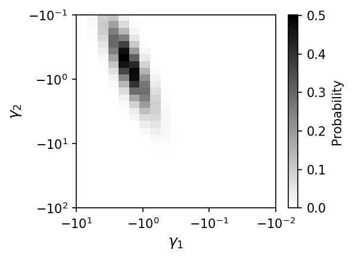
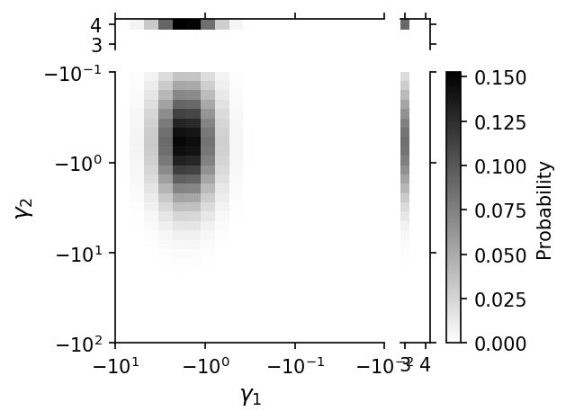
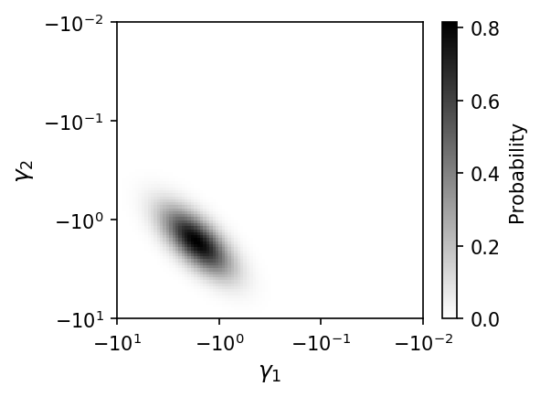
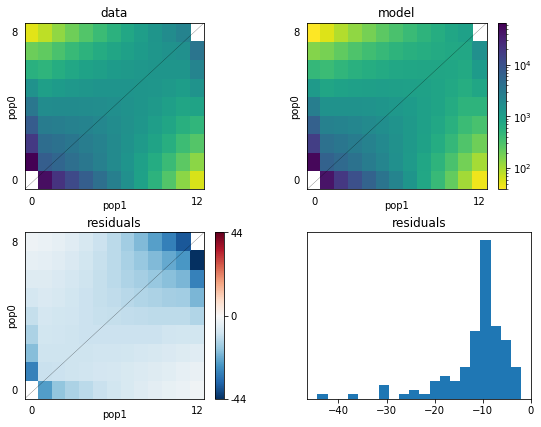

# DFE inference


```python
import pickle, random
import numpy as np
import nlopt
import dadi
import dadi.DFE as DFE
import matplotlib.pyplot as plt
from dadi.DFE import *
```

### 1D examples


```python
# For multiprocessing to work on Windows, all script code must be wrapped
# in this block. If you're not on Windows, feel free to remove this if statement.
if __name__ == '__main__':
    # Set demographic parameters and theta. This is usually inferred from
    # synonymous sites. In this case, we'll be using a two-epoch model.
    demog_params = [2, 0.05]
    theta_ns = 4000.
    ns = [250]

    # Integrate over a range of gammas
    #pts_l = [600, 800, 1000]
    #spectra = DFE.Cache1D(demog_params, ns, DFE.DemogSelModels.two_epoch, pts_l=pts_l, 
    #                      gamma_bounds=(1e-5, 500), gamma_pts=100, verbose=True,
    #                      mp=True)
    # The spectra can be pickled for usage later. This is especially convenient
    # if the process of generating the spectra takes a long time.
    #pickle.dump(spectra, open('example_spectra.bpkl','wb'))
    # To load them, use this code
    spectra = pickle.load(open('example_spectra.bpkl','rb'))
```


```python
#load sample data
data = dadi.Spectrum.from_file('example.fs')

# Fit a DFE to the data
# Initial guess and bounds
sel_params = [0.2, 1000.]
lower_bound, upper_bound = [1e-3, 1e-2], [1, 50000.]
p0 = dadi.Misc.perturb_params(sel_params, lower_bound=lower_bound,
                              upper_bound=upper_bound)
popt = dadi.Inference.opt(p0, data, spectra.integrate, pts=None,
                          func_args=[DFE.PDFs.gamma, theta_ns],
                          lower_bound=lower_bound, upper_bound=upper_bound, 
                          verbose=len(sel_params), maxiter=10, multinom=False)

# Get expected SFS for MLE
model_sfs = spectra.integrate(popt, None, DFE.PDFs.gamma, theta_ns, None)
```


```python
# One possible characterization of the neutral+gamma DFE
# Written using numpy tricks to work with both scalar and array arguments
def neugamma(xx, params):
    pneu, alpha, beta = params
    # Convert xx to an array
    xx = np.atleast_1d(xx)
    out = (1-pneu)*DFE.PDFs.gamma(xx, (alpha, beta))
    # Assume gamma < 1e-4 is essentially neutral
    out[np.logical_and(0 <= xx, xx < 1e-4)] += pneu/1e-4
    # Reduce xx back to scalar if it's possible
    return np.squeeze(out)

sel_params = [0.2, 0.2, 1000.]
lower_bound, upper_bound = [1e-3, 1e-3, 1e-2], [1, 1, 50000.]
p0 = dadi.Misc.perturb_params(sel_params, lower_bound=lower_bound,
                              upper_bound=upper_bound)
popt = dadi.Inference.opt(p0, data, spectra.integrate, pts=None,
                          func_args=[neugamma, theta_ns],
                          lower_bound=lower_bound, upper_bound=upper_bound, 
                          verbose=len(sel_params),
                          maxiter=10, multinom=False)
```


```python
#
# Modeling ancestral state misidentification, using dadi's built-in function to 
# wrap fitdadi's integrate method.
#
p_misid = 0.05
data = dadi.Numerics.apply_anc_state_misid(data, p_misid)
misid_func = dadi.Numerics.make_anc_state_misid_func(spectra.integrate)
sel_params = [0.2, 1000., 0.2]
lower_bound, upper_bound = [1e-3, 1e-2, 0], [1, 50000., 1]
p0 = dadi.Misc.perturb_params(sel_params, lower_bound=lower_bound,
                              upper_bound=upper_bound)
popt = dadi.Inference.opt(p0, data, misid_func, pts=None,
                          func_args=[DFE.PDFs.gamma, theta_ns],
                          lower_bound=lower_bound, upper_bound=upper_bound,
                          verbose=len(sel_params), maxiter=10,
                          multinom=False)
```


```python
#
# Including a point mass of positive selection
#
data = dadi.Spectrum.from_file('example.fs')
ppos = 0.1
sel_data = theta_ns*DFE.DemogSelModels.two_epoch(tuple(demog_params) + (5,), ns, pts_l[-1])
data_pos = (1-ppos)*data + ppos*sel_data

sel_params = [0.2, 1000., 0.2, 2]
lower_bound, upper_bound = [1e-3, 1e-2, 0, 0], [1, 50000., 1, 50]
p0 = dadi.Misc.perturb_params(sel_params, lower_bound=lower_bound,
                              upper_bound=upper_bound)
popt = dadi.Inference.opt(p0, data_pos, spectra.integrate_point_pos, pts=None,
                          func_args=[DFE.PDFs.gamma, theta_ns, DFE.DemogSelModels.two_epoch], 
                          lower_bound=lower_bound, upper_bound=upper_bound, 
                          verbose=len(sel_params), maxiter=10, multinom=False)
```


```python
#
# Multiple point masses of positive selection
#
# Parameters are mu, sigma, ppops1, gammapos1, ppos2, gammapos2
sel_params = [3,2,0.1,2,0.3,6]
input_fs = spectra.integrate_point_pos(sel_params,None,DFE.PDFs.lognormal,theta_ns,
                                       DFE.DemogSelModels.two_epoch, 2)
data = input_fs.sample()
lower_bound, upper_bound = [-1,0.1,0,0,0,0], [5,5,1,10,1,20]
p0 = dadi.Misc.perturb_params(sel_params, lower_bound=lower_bound,
                              upper_bound=upper_bound)

def ieq_constraint(p,*args):
    # Our constraint is that ppop1+ppos2 must be less than 1.
    return [1-(p[2]-p[4])]

popt = dadi.Inference.opt(p0, data, spectra.integrate_point_pos, pts=None,
                          func_args=[DFE.PDFs.lognormal, theta_ns,
                                     DFE.DemogSelModels.two_epoch, 2],
                          lower_bound=lower_bound, upper_bound=upper_bound,
                          ieq_constraint=ieq_constraint,
                          # Fix gammapos1
                          fixed_params=[None,None,None,2,None,None],
                          verbose=len(sel_params),
                          maxiter=10, multinom=False)
```

### 2D examples


```python
# Seed random number generator, so example is reproducible
np.random.seed(1398238)
    
#
# Plotting a joint DFE
#
sel_dist = PDFs.biv_lognormal
params = [0.5,-0.5,0.5,1,-0.8]
gammax, gammay = -np.logspace(-2, 1, 20), -np.logspace(-1, 2, 30)
    
fig = plt.figure(137, figsize=(4,3), dpi=150)
fig.clear()
ax = fig.add_subplot(1,1,1)
Plotting.plot_biv_dfe(gammax, gammay, sel_dist, params, logweight=True, ax=ax)
fig.tight_layout()
```





```python
# With positive selection
params = [0.5,-0.5,0.5,1,0.0,0.3,3,0.3,4]
fig = Plotting.plot_biv_point_pos_dfe(gammax, gammay, sel_dist, params,
                                      fignum=23, rho=params[4])
```





```python
# For multiprocessing to work on Windows, all script code must be wrapped
# in this block. If you're not on Windows, feel free to remove this if statement.
if __name__ == '__main__':
    #
    # Full test of optimization machinery. 
    # Considering only a narrow range of gammas, so integration is faster.
    #
    demo_params = [0.5,2,0.5,0.1,0,0]
    ns = [8, 12]
    pts_l = [60, 80, 100]
    func_ex = DemogSelModels.IM
    # Check whether we already have a chached set of 2d spectra. If not
    # generate them.
    try:
        s2 = pickle.load(open('test.spectra2d.bpkl', 'rb'))
    except IOError:
        s2 = Cache2D(demo_params, ns, func_ex, pts=pts_l, gamma_pts=100,
                     gamma_bounds=(1e-2, 10), verbose=True, mp=True,
                     additional_gammas=[1.2, 4.3])
        # Save spectra2d object
        fid = open('test.spectra2d.bpkl', 'wb')
        pickle.dump(s2, fid, protocol=2)
        fid.close()

        ## Cache generation can be very computationally expensive, even
        ## with multiprocessing. If you need to split the work across multiple
        ## compute nodes, use the split_jobs and this_job_id arguments, then
        ## merge the partial caches.
        ## In this example, the 3 partial caches could be generate on independent
        ## nodes, then s2a,s2b,s2c would be saved to separate files, then loaded
        ## and combined later.
        #s2a = Cache2D(demo_params, ns, func_ex, pts=pts_l, gamma_pts=100,
        #        gamma_bounds=(1e-2, 10), verbose=True, mp=True,
        #        additional_gammas=[1.2, 4.3], split_jobs=3, this_job_id=0)
        #s2b = Cache2D(demo_params, ns, func_ex, pts=pts_l, gamma_pts=100,
        #        gamma_bounds=(1e-2, 10), verbose=True, mp=True,
        #        additional_gammas=[1.2, 4.3], split_jobs=3, this_job_id=1)
        #s2c = Cache2D(demo_params, ns, func_ex, pts=pts_l, gamma_pts=100,
        #        gamma_bounds=(1e-2, 10), verbose=True, mp=True,
        #        additional_gammas=[1.2, 4.3], split_jobs=3, this_job_id=2)
        #s2 = Cache2D.merge([s2a, s2b, s2c]) 
```


```python
# Generate test data set to fit
input_params, theta = [0.5,0.5,-0.8], 1e5
sel_dist = PDFs.biv_lognormal
# Expected sfs
target = s2.integrate(input_params, None, sel_dist, theta, None)
# Get data with Poisson variance around expectation
data = target.sample()
    
# Parameters are mean, variance, and correlation coefficient
p0 = [0,1.,0.8]
popt = dadi.Inference.opt(p0, data, s2.integrate, pts=None,
                          func_args=[sel_dist, theta],
                          lower_bound=[None,0,-1],
                          upper_bound=[None,None,1],
                          verbose=30, multinom=False)
print('Input parameters: {0}'.format(input_params))
print('Optimized parameters: {0}'.format(popt))
```

    480     , -2651.22    , array([ 0.712271   ,  0.304346   ,  0.592511   ])
    510     , -740.865    , array([ 0.541592   ,  0.790878   ,  0.520651   ])
    540     , -519.63     , array([ 0.497606   ,  0.512338   , -0.64606    ])
    570     , -519.624    , array([ 0.497503   ,  0.510381   , -0.665866   ])
    600     , -519.624    , array([ 0.497503   ,  0.510381   , -0.665865   ])
    630     , -519.624    , array([ 0.497503   ,  0.510381   , -0.665865   ])
    660     , -519.624    , array([ 0.497503   ,  0.510381   , -0.665865   ])
    690     , -519.624    , array([ 0.497503   ,  0.510381   , -0.665865   ])
    720     , -519.624    , array([ 0.497503   ,  0.510381   , -0.665865   ])
    Input parameters: [0.5, 0.5, -0.8]
    Optimized parameters: [ 0.49750313  0.51038084 -0.66686542]


```python
# Plot inferred DFE. Note that this will render slowly, because grid of
# gammas is fairly dense.
fig = plt.figure(231, figsize=(4,3), dpi=150)
fig.clear()
ax = fig.add_subplot(1,1,1)
Plotting.plot_biv_dfe(s2.gammas, s2.gammas, sel_dist, popt, ax=ax)
fig.tight_layout()
```





```python
#
# Test point mass of positive selection. To do so, we test against
# the single-population case using very high correlation.
#
params = [-0.5,0.5,0.99, 0.1, 4.3]
fs_biv = s2.integrate_symmetric_point_pos(params, None, PDFs.biv_lognormal, theta,
                                          pts=None)
    
func_single_ex = DemogSelModels.IM_single_gamma
try:
    s1 = pickle.load(open('test.spectra1d.bpkl', 'rb'))
except IOError:
    s1 = Cache1D(demo_params, ns, func_single_ex, pts_l=pts_l,
                 gamma_pts=100, gamma_bounds=(1e-2, 10), mp=True,
                 additional_gammas = [1.2, 4.3], verbose=False)
    fid = open('test.spectra1d.bpkl', 'wb')
    pickle.dump(s1, fid, protocol=2)
    fid.close()
    
fs1 = s1.integrate_point_pos([-0.5,0.5,0.1,4.3], None, PDFs.lognormal,
                             1e5, func_single_ex)
    
fig = dadi.Plotting.pylab.figure(figsize=(8,6))
fig.clear()
dadi.Plotting.plot_2d_comp_Poisson(fs1, fs_biv, show=False)
```





```python
#
# Test optimization of point mass positive selection.
#
    
# Generate test data set to fit
# This is a symmetric case, with mu1=mu2=0.5, sigma1=sigma2=0.3, rho=-0.5,
# ppos1=ppos2=0.2, gammapos1=gammapos2=1.2.
input_params, theta = [0.5,0.3,-0.5,0.2,1.2], 1e5
# Expected sfs
target = s2.integrate_symmetric_point_pos(input_params, None, sel_dist, theta,
                                          pts=None)
# Get data with Poisson variance around expectation
data = target.sample()
    
# We'll fit using our special-case symmetric function. The last
# two arguments are ppos and gammapos. The first three are thus for the
# lognormal distribution. Note that our lognormal distribution assumes
# symmetry if the length of the arguments is only three. If we wanted
# asymmetric lognormal, we would pass in a p0 of total length 7.
p0 = [0.3,0.3,0.1,0.2,1.2]
popt = dadi.Inference.opt(p0, data,
                          s2.integrate_symmetric_point_pos,
                          pts=None, func_args=[sel_dist, theta],
                          # Note that mu in principle has no lower or
                          # upper bound, sigma has only a lower bound
                          # of 0, ppos is bounded between 0 and 1, and
                          # gamma pos is bounded from below by 0.
                          lower_bound=[-1,0.1,-1,0,0],
                          upper_bound=[1,1,1,1,None],
                          # We fix the gammapos to be 1.2, because
                          # we can't do this integration effectively
                          # if gammapos is allowed to vary.
                          fixed_params=[None,None,None,None,1.2],
                          verbose=30, multinom=False)
print('Symmetric test fit')
print('  Input parameters: {0}'.format(input_params))
print('  Optimized parameters: {0}'.format(popt))
```

    780     , -728.975    , array([ 0.317945   ,  0.301612   ,  0.0992905  ,  0.139505   ,  1.2        ])
    810     , -575.018    , array([ 0.438034   ,  0.538922   , -0.403391   ,  0.173301   ,  1.2        ])
    840     , -575.018    , array([ 0.438034   ,  0.538921   , -0.403391   ,  0.173301   ,  1.2        ])
    870     , -553.801    , array([ 0.448013   ,  0.430578   , -0.467847   ,  0.18045    ,  1.2        ])
    900     , -551.71     , array([ 0.42946    ,  0.434882   , -0.459367   ,  0.178665   ,  1.2        ])
    930     , -551.71     , array([ 0.42946    ,  0.434881   , -0.459368   ,  0.178665   ,  1.2        ])
    960     , -551.71     , array([ 0.42946    ,  0.434881   , -0.459368   ,  0.178665   ,  1.2        ])
    990     , -551.71     , array([ 0.42946    ,  0.434881   , -0.459368   ,  0.178665   ,  1.2        ])
    1020    , -551.71     , array([ 0.42946    ,  0.434881   , -0.459368   ,  0.178665   ,  1.2        ])
    1050    , -551.71     , array([ 0.42946    ,  0.434881   , -0.459368   ,  0.178665   ,  1.2        ])
    1080    , -551.71     , array([ 0.42946    ,  0.434881   , -0.459368   ,  0.178665   ,  1.2        ])
    1110    , -551.71     , array([ 0.42946    ,  0.434881   , -0.459368   ,  0.178665   ,  1.2        ])
    1140    , -551.71     , array([ 0.42946    ,  0.434881   , -0.459368   ,  0.178665   ,  1.2        ])
    1170    , -551.71     , array([ 0.42946    ,  0.434881   , -0.459368   ,  0.178665   ,  1.2        ])
    1200    , -551.71     , array([ 0.42946    ,  0.434881   , -0.459368   ,  0.178665   ,  1.2        ])
    1230    , -551.71     , array([ 0.42946    ,  0.434881   , -0.459368   ,  0.178665   ,  1.2        ])
    1260    , -551.71     , array([ 0.42946    ,  0.434881   , -0.459368   ,  0.178665   ,  1.2        ])
    1290    , -551.73     , array([ 0.429022   ,  0.43591    , -0.458862   ,  0.178569   ,  1.2        ])
    Symmetric test fit
      Input parameters: [0.5, 0.3, -0.5, 0.2, 1.2]
      Optimized parameters: [ 0.42946048  0.43488087 -0.45936782  0.17866528  1.2       ]


```python
#
# Mixture model
#
    
# Now a mixture model, which adds together a 2D distribution and a 
# perfectly correlated 1D distribution.
# Input parameters here a mu, sigma, rho for 2D (fixed to zero), 
#   proportion positive, gamma positive, proportion 2D, 
input_params, theta = [0.5,0.3,0,0.2,1.2,0.2], 1e5
# Expected sfs
target = mixture_symmetric_point_pos(input_params,None,s1,s2,PDFs.lognormal,
                                     PDFs.biv_lognormal, theta)
p0 = [0.3,0.3,0,0.2,1.2,0.3]
popt = dadi.Inference.opt(p0, data, mixture_symmetric_point_pos, pts=None, 
                          func_args=[s1, s2, PDFs.lognormal,
                                     PDFs.biv_lognormal, theta],
                          lower_bound=[None, 0.1,-1,0,None, 0],
                          upper_bound=[None,None, 1,1,None, 1],
                          # We fix both the rho assumed for the 2D distribution,
                          # and the assumed value of positive selection.
                          fixed_params=[None,None,0,None,1.2,None],
                          verbose=30, multinom=False, maxiter=1)
```

    1320    , -2719       , array([ 0.189489   ,  0.293573   ,  0          ,  0.133956   ,  1.2        ,  0.439247   ])


```python
#
# Test Godambe code for estimating uncertainties
#
input_params = [0.3,0.3,0.1,0.2,1.2]
# Generate data in segments for future bootstrapping
fs0 = s2.integrate_symmetric_point_pos(input_params, None, sel_dist,
                                       theta/100., pts=None)
# The multiplication of fs0 is to create a range of data size among
# bootstrap chunks, which creates a range of thetas in the bootstrap
# data sets.
data_pieces = [(fs0*(0.5 + (1.5-0.5)/99*ii)).sample() for ii in range(100)]
# Add up those segments to get our data spectrum
data = dadi.Spectrum(np.sum(data_pieces, axis=0))
# Do the optimization
popt = dadi.Inference.opt([0.2,0.2,0.15,0.3,1.2], data,
                          s2.integrate_symmetric_point_pos,
                          pts=None, func_args=[sel_dist, theta],
                          lower_bound=[-1,0.1,-1,0,0],
                          upper_bound=[1,1,1,1,None],
                          fixed_params=[None,None,None,None,1.2],
                          verbose=30, multinom=False)
    
print('Symmetric test fit')
print('  Input parameters: {0}'.format(input_params))
print('  Optimized parameters: {0}'.format(popt))
```

    1380    , -834.159    , array([ 0.164119   ,  0.462983   , -0.0814004  ,  0.129806   ,  1.2        ])
    1410    , -547.791    , array([ 0.211566   ,  0.491704   ,  0.0874909  ,  0.180269   ,  1.2        ])
    1440    , -547.791    , array([ 0.211546   ,  0.491728   ,  0.0874776  ,  0.180265   ,  1.2        ])
    1470    , -547.791    , array([ 0.211566   ,  0.491704   ,  0.0874909  ,  0.180269   ,  1.2        ])
    1500    , -547.791    , array([ 0.211566   ,  0.491704   ,  0.0874909  ,  0.180269   ,  1.2        ])
    1530    , -547.791    , array([ 0.211566   ,  0.491704   ,  0.0874909  ,  0.180269   ,  1.2        ])
    1560    , -547.791    , array([ 0.211566   ,  0.491704   ,  0.0874909  ,  0.180269   ,  1.2        ])
    1590    , -547.791    , array([ 0.211566   ,  0.491704   ,  0.0874909  ,  0.180269   ,  1.2        ])
    1620    , -547.791    , array([ 0.211566   ,  0.491704   ,  0.0874909  ,  0.180269   ,  1.2        ])
    1650    , -547.791    , array([ 0.211566   ,  0.491704   ,  0.0874909  ,  0.180269   ,  1.2        ])
    1680    , -547.791    , array([ 0.211566   ,  0.491704   ,  0.0874909  ,  0.180269   ,  1.2        ])
    1710    , -547.791    , array([ 0.211566   ,  0.491704   ,  0.0874909  ,  0.180269   ,  1.2        ])
    1740    , -547.791    , array([ 0.211566   ,  0.491704   ,  0.0874909  ,  0.180269   ,  1.2        ])
    1770    , -547.791    , array([ 0.211566   ,  0.491704   ,  0.0874909  ,  0.180269   ,  1.2        ])
    Symmetric test fit
      Input parameters: [0.3, 0.3, 0.1, 0.2, 1.2]
      Optimized parameters: [0.21156582 0.49170413 0.0874909  0.18026894 1.2       ]


```python
# Generate bootstraps for Godambe
all_boot = []
for boot_ii in range(100):
    # Each bootstrap is made by sampling, with replacement, from our data
    # pieces
    this_pieces = [random.choice(data_pieces) for _ in range(100)]
    all_boot.append(dadi.Spectrum(np.sum(this_pieces, axis=0)))
    
# The Godambe methods only accept a basic dadi function that takes in
# parameters, ns, and pts. Moreover, we can't allow gammapos to vary.
# (We don't have variations around those cached. We could work around this
# by pre-caching the necessary values, but it would be inelegant.) So
# we create this simple function that holds gammapos constant and removes
# it from the argument list.
def temp_func(pin, ns, pts):
    # Add in gammapos parameter
    params = np.concatenate([pin, [1.2]])
    return s2.integrate_symmetric_point_pos(params, None, sel_dist,
                                            theta, pts=None)
    
# Run the uncertainty analysis. Note that each bootstrap data set
# needs a different assumed theta. We estimate theta for each bootstrap
# data set simply by scaling theta from the orignal data.
import dadi.Godambe
boot_theta_adjusts = [b.sum()/data.sum() for b in all_boot]
uncerts_adj = dadi.Godambe.GIM_uncert(temp_func, [], all_boot, popt[:-1],
                                      data, multinom=False,
                                      boot_theta_adjusts=boot_theta_adjusts)
print('Godambe uncertainty test')
print('  Input parameters: {0}'.format(input_params))
print('  Optimized parameters: {0}'.format(popt))
print('  Estimated 95% uncerts (theta adj): {0}'.format(1.96*uncerts_adj))
    
# Ensure plots show up on screen.
plt.show()
```

    If you use the Godambe methods in your published research, please cite Coffman et al. (2016) in addition to the main dadi paper Gutenkunst et al. (2009).
    AJ Coffman, P Hsieh, S Gravel, RN Gutenkunst "Computationally efficient composite likelihood statistics for demographic inference" Molecular Biology and Evolution 33:591-593 (2016)
    Godambe uncertainty test
      Input parameters: [0.3, 0.3, 0.1, 0.2, 1.2]
      Optimized parameters: [0.21156582 0.49170413 0.0874909  0.18026894 1.2       ]
      Estimated 95% uncerts (theta adj): [0.13605768 0.24219983 0.12923959 0.02939663]

