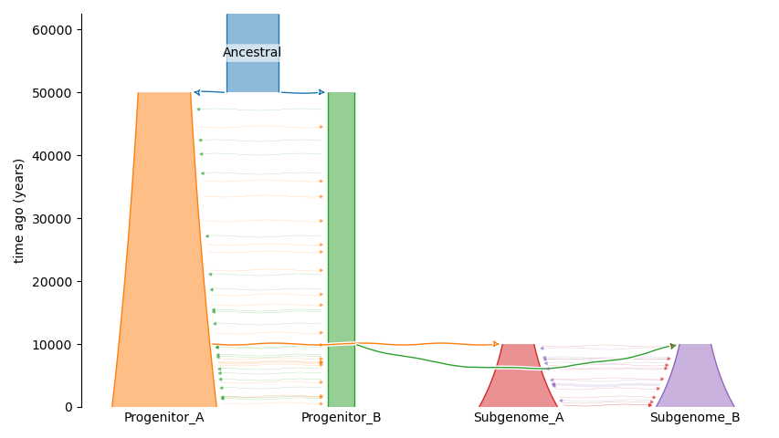
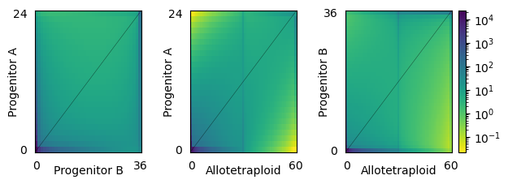
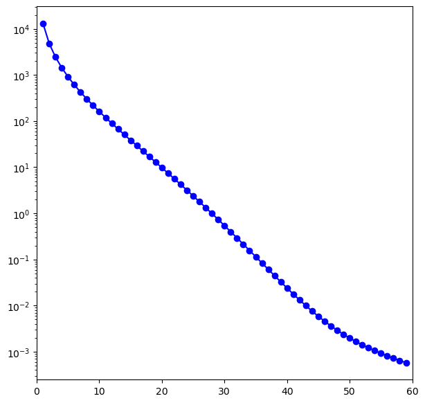
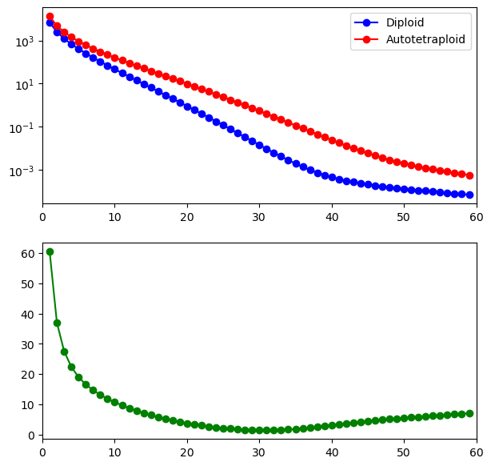
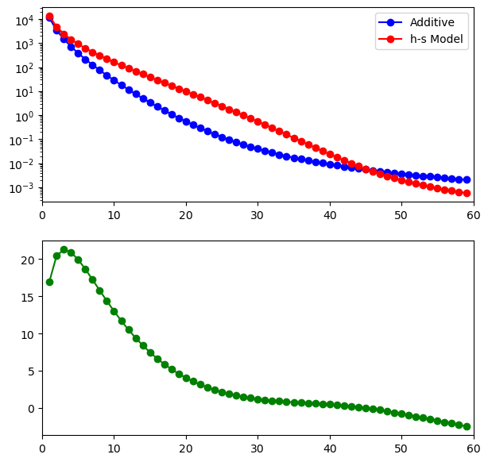
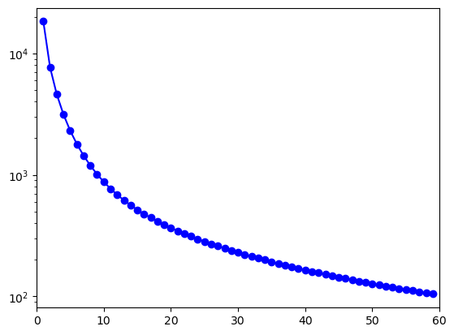
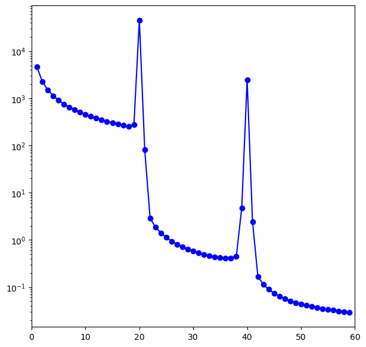

# Polyploidy model examples

This notebook demonstrates how to use the `dadi.Polyploidy.Integration` module to simulate and define more complex polyploidy models.

### Model of allotetraploids with diploid progenitors

Here, we outline a demographic model in which we jointly model the SFS of the two subgenomes of an allotetraploid with both diploid progenitors. In this model, one of the diploid progenitors will grow exponentially, the other will have a single size change, and the allotetraploid will have a bottlegrowth size history. We will also include symmetric migration between the diploid progenitors and homoeologous exchange between the subgenomes. 

We start by loading the relevant modules from `dadi` and `numpy`.

```python
# load required modules
from dadi import Numerics, PhiManip
from dadi.Spectrum_mod import Spectrum
from dadi.Polyploidy import Integration
from dadi.Polyploidy.Integration import PloidyType
import numpy
```

Then, we can define the demographic model

```python
# define the demographic model function
def allotetraploid_with_diploid_progenitors(params, ns, pts):
    """
    Model of allotetraploid formation with diploid progenitors.
    
    Parameters:
        params (tuple): (T_dip_div, nu_f_dip1, nu_f_dip2, M, T_WGD, nu_b_allo, nu_f_allo, H)
            - T_dip_div: Total time of the diploid progenitor divergence
               (in units of 2*Na generations).
            - nu_f_dip1: Final/contemporary effective population size of the first diploid progenitor 
                after a period of exponential growth begining at the.
            - nu_f_dip2: Final/contemporary effective population size of the second diploid progenitor
                after a single size change at the time of WGD.
            - M: Migration rate between the two diploid progenitors for all epochs (2*Na*m).
            - T_WGD: Time in the past at which the WGD occurred, creating the  
               allotetraploid population (in units of 2*Na generations).
            - nu_b_allo: Bottlenecked effective population size of the allotetraploid population.
            - nu_f_allo: Final/contemporary effective population size of the allotetraploid population.
            - H: homoeologous exchange rate between the two subgenomes, = 2*Na*eta
        ns (tuple): Sample sizes (n_dip1, n_dip2, n_allo, n_allo).
        pts (int): Number of grid points to use in integration.
    
    Returns:
        fs (Spectrum): The resulting frequency spectrum.
    """
    # unpack the parameters
    T_dip_div, nu_f_dip1, nu_f_dip2, M, T_WGD, nu_b_allo, nu_f_allo, H = params
    
    # initialize the numerical grid and phi
    xx = Numerics.default_grid(pts)
    phi = PhiManip.phi_1D(xx)
    
    # model the split of the diploid progenitors
    phi = PhiManip.phi_1D_to_2D(xx, phi)

    # function for the size of the first diploid progenitor
    T_total = T_dip_div + T_WGD
    nu_func_dip1 = lambda t: numpy.exp(numpy.log(nu_f_dip1) * t/T_total)

    # integrate to model the diploid progentitor divergence
    phi = Integration.two_pops(phi, xx, T_dip_div, 
                               nu1=nu_func_dip1, nu2=nu_f_dip2, 
                               m12=M, m21=M)
    
    # model the allotetraploid formation by splitting phi twice more
    # the third dimension is subgenome A derived entirely from the first diploid progenitor
    phi = PhiManip.phi_2D_to_3D(phi, 1, xx, xx, xx)
    # the fourth dimension is subgenome B derived entirely from the second diploid progenitor
    phi = PhiManip.phi_3D_to_4D(phi, 0, 1, xx, xx, xx, xx)

    # for the second integration, time will be reset to run from 0 to T_WGD, so we need to
    # redefine the function for the size of the first diploid progenitor
    nu_func_dip1 = lambda t: numpy.exp(numpy.log(nu_f_dip1) * (t+T_dip_div)/T_total)
    # and define the function for the bottlegrowth size of the allotetraploid
    nu_allo = lambda t: nu_b_allo * numpy.exp(numpy.log(nu_f_allo/nu_b_allo) * t/T_WGD)

    # then, integrate for a period of T_WGD to reach the present
    phi = Integration.four_pops(phi, xx, T_WGD, 
                                nu1=nu_func_dip1, nu2=nu_f_dip2, nu3=nu_allo, nu4=nu_allo,
                                m12=M, m21=M, m34=H, m43=H,
                                ploidyflag3=PloidyType.ALLOa, ploidyflag4=PloidyType.ALLOb)
    
    # and calculate and return the SFS
    fs = Spectrum.from_phi(phi, ns, (xx, xx, xx, xx))
    return fs
```

and use it to simulate a sample SFS
```python
# then, we can generate an example SFS
# params = (T_dip_div, nu_f_dip1, nu_f_dip2, M, T_WGD, nu_b_allo, nu_f_allo, H)
params = [1.0, 2, 0.5, 0.5, 0.25, 0.6, 1.5, 0.1]
ns = (24, 36, 30, 30)
# we arbitrarily scale by theta = 5000 here to get more realistic counts in the SFS
sfs = 5000 * allotetraploid_with_diploid_progenitors(params, ns, max(ns)+11)
# optionally, we can save the SFS to a file by uncommenting the following line
sfs.to_file('allotetraploid_with_diploid_progenitors.sfs')
```

Then we can use many of the existing methods in `dadi` to visualize the model and the SFS. For example, we can plot visualize the demographic model using the `demes` and `demesdraw` packages:

```python
import demes, demesdraw
# define the demes graph with relabeled demes/populations
g = dadi.Demes.output(Nref=10000, generation_time=2, 
                      deme_mapping={'Ancestral':['d1_1'],
                                    'Progenitor_A':['d2_1', 'd3_1'],
                                    'Progenitor_B':['d2_2', 'd3_2'],
                                    'Subgenome_A':['d3_3'],
                                    'Subgenome_B':['d4_4']})

# optionally, we can save the demes graph to a file
g.description = 'Example model of allotetraploid formation with diploid progenitors'
demes.dump(g, 'polyploidy_example.yaml')

# and, we can also visualize the demographic model with the demesdraw package
ax = demesdraw.tubes(g)
ax.figure.savefig('allotetraploid_w_dips_demesdraw.png')
```



And using the `Plotting` module in `dadi` to visualize the SFS:

```python
import matplotlib.pyplot as plt
# if saved to a file, we can load the SFS
sfs = dadi.Spectrum.from_file('allotetraploid_with_diploid_progenitors.sfs')
# then, we combine the two subgenomes for plotting
sfs_collapsed = sfs.combine_pops([3,4])

dadi.Plotting.plot_3d_pairwise(sfs_collapsed, pop_ids=['Progenitor A', 'Progenitor B', 'Allotetraploid'], show=False)
fig = plt.gcf()
fig.set_size_inches(6.5,2)
fig.savefig('allotetraploid_w_dips_sfs.png', bbox_inches='tight')
```



The slightly darker (higher frequency) vertical bands in the marginalized spectra with the collapsed allotetraploid population reflect fixed heterozygosity in one of the subgenomes. 

### Model of autotetraploids with non-additive selection

The examples we have considered so far have either been neutral demographic models or only included additive selection. Since selection is implemented slightly differently in `dadi` for polyploids, we outline a non-additive model of selection in autotetraploids below. The specific non-additive model we adopt is based on the h-s model inferred from selfing and outcrossing _Arabidopsis_ data from [Huber et al. _Nat Commun_ 2018](https://doi.org/10.1038/s41467-018-05281-7) and extended to tetraploids by [Booker and Schrider _Am Nat_ 2025](https://doi.org/10.1086/733334).

```python
# load required modules
from dadi import Numerics, PhiManip
from dadi.Spectrum_mod import Spectrum
from dadi.Polyploidy import Integration
from dadi.Polyploidy.Integration import PloidyType
import numpy

# define the demographic model with non-additive selection
def autotetraploid_bottlegrowth_selection(params, ns, pts, N_a):
    """
    Model of autotetraploid undergoing a bottlegrowth size history 
    with non-additive selection.
    
    Parameters:
        params (tuple): (T_WGD, nu_b, nu_f, gamma)
            - T_WGD: Time in the past at which the WGD occurred, creating the  
               autotetraploid population (in units of 2*Na generations).
            - nu_b: Bottlenecked effective population size of the autotetraploid population.
            - nu_f: Final/contemporary effective population size of the autotetraploid population.
            - gamma: population-scaled selection coefficient 
        ns (tuple): Sample sizes (n_auto,).
        pts (int): Number of grid points to use in integration.
        N_a (float): Effective population size of the ancestral population.
            This can be calculated as N_a = theta / (4*mu*L) where theta is inferred from the neutral or
            synonymous SFS, mu is the mutation rate, and L is the effective sequencing length.
    
    Returns:
        fs (Spectrum): The resulting frequency spectrum.
    """
    # unpack the parameters
    T_WGD, nu_b, nu_f, gamma = params

    # here, we implement a non-additive selection model based on the work of Booker and Schrider 2025
    # their model is defined in terms of s (not gamma), so we need to compute gamma from s
    s = gamma / (2*N_a)
    # following their notation, Eqn. 3 is:
    theta_int = 0.978
    theta_rate = 50328
    h = 1 / (1/theta_int - theta_rate * s)
    # then, we can compute Z for each dosage using Eqn. 8:
    Z_list = []
    # for each dosage/genotype (i=1,2,3), P = 1 - i/4
    for i in [1,2,3]:
        P = 1 - i/4
        Z = (1-P)*h / ( (1-h)*P + h*(1-P) )
        Z_list.append(Z)
    
    # then, we can construct the dictionary of selection coefficients
    sel_dict = {'gamma': gamma, 'h1': Z_list[0], 'h2': Z_list[1], 'h3': Z_list[2]}

    # initialize the numerical grid and phi
    xx = Numerics.default_grid(pts)
    # the best approximation for the full autotetraploid selection model
    # is to use gamma and the h calculated above for the diploid parameters
    phi = PhiManip.phi_1D(xx, gamma=gamma, h=h)

    # and implement the bottlegrowth size history with selection
    nu_func = lambda t: nu_b * numpy.exp(numpy.log(nu_f/nu_b) * t/T_WGD)
    phi = Integration.one_pop(phi, xx, T_WGD, nu=nu_func, sel_dict=sel_dict, ploidyflag=PloidyType.AUTO)
    
    fs = Spectrum.from_phi(phi, ns, (xx,))
    return fs

# then, we can generate an example SFS
# params = (T_WGD, nu_b, nu_f, gamma)
params = [1.0, 0.3, 2, -10]
ns = (60,)
# we arbitrarily scale by theta = 5000 here to get more realistic counts in the SFS 
# for N_a (ancestral effective population size), we use 1e5 which is in the right ballpark for Arabidopsis
sfs = 5000 * autotetraploid_bottlegrowth_selection(params, ns, max(ns)+101, N_a=1e5)
```

The resulting SFS (from `dadi.Plotting.plot_1d_fs`) is shown below:


We can then compare to the comparable diploid model with the same non-additive selection model and demographic history: 
```python
def diploid_bottlegrowth_selection(params, ns, pts, N_a):
    """
    Model of diploid undergoing a bottlegrowth size history 
    with non-additive selection.
    
    Parameters:
        params (tuple): (T, nu_b, nu_f, gamma)
            - T_WGD: Time in the past at which the WGD occurred, creating the  
               autotetraploid population (in units of 2*Na generations).
            - nu_b: Bottlenecked effective population size of the autotetraploid population.
            - nu_f: Final/contemporary effective population size of the autotetraploid population.
            - gamma: population-scaled selection coefficient 
        ns (tuple): Sample sizes (n_auto,).
        pts (int): Number of grid points to use in integration.
        N_a (float): Effective population size of the ancestral population.
            This can be calculated as N_a = theta / (4*mu*L) where theta is inferred from the neutral or
            synonymous SFS, mu is the mutation rate, and L is the effective sequencing length.
    
    Returns:
        fs (Spectrum): The resulting frequency spectrum.
    """
    # unpack the parameters
    T_WGD, nu_b, nu_f, gamma = params

    # here, we implement a non-additive selection model based on the work of Booker and Schrider 2025
    # their model is defined in terms of s (not gamma), so we need to compute gamma from s
    s = gamma / (2*N_a)
    # following their notation, Eqn. 3 is:
    theta_int = 0.978
    theta_rate = 50328
    h = 1 / (1/theta_int - theta_rate * s)
    
    # then, we can construct the dictionary of selection coefficients
    sel_dict = {'gamma': gamma, 'h': h}

    # initialize the numerical grid and phi
    xx = Numerics.default_grid(pts)
    # and initialize phi
    phi = PhiManip.phi_1D(xx, gamma=gamma, h=h)

    # and implement the bottlegrowth size history with selection
    nu_func = lambda t: nu_b * numpy.exp(numpy.log(nu_f/nu_b) * t/T_WGD)
    phi = Integration.one_pop(phi, xx, T_WGD, nu=nu_func, sel_dict=sel_dict)
    
    fs = Spectrum.from_phi(phi, ns, (xx,))
    return fs
    
params = [1.0, 0.3, 2, -10]
ns = (60,)
sfs_dip = 5000 * diploid_bottlegrowth_selection(params, ns, max(ns)+101, N_a=1e5)

# then, compare the diploid and autotetraploid SFS
dadi.Plotting.plot_1d_comp_Poisson(sfs, sfs_dip, fig_num=102, show=False)
fig = plt.gcf()
ax = fig.axes[0]
handles, labels = ax.get_legend_handles_labels()
# relabel the legend
ax.legend(handles, ['Diploid', 'Autotetraploid'], loc='upper right')
fig.savefig('dip_auto_nonadditive_selection.png', bbox_inches='tight')
```


Similiarly, we can compare the bottlegrowth non-additive selection model for autotetraploids to the comparable model with additive selection:

```python
# load the predefined additive selection model 
model = dadi.Polyploidy.auto_demographics_sel.bottlegrowth_sel
params = [1.0, 0.3, 2, -10]
ns = (60,)
sfs_additive = 5000*model(params, ns, max(ns)+101)
# plot and save the comparison
dadi.Plotting.plot_1d_comp_Poisson(sfs, sfs_additive, fig_num=102, show=False)
fig = plt.gcf()
ax = fig.axes[0]
handles, labels = ax.get_legend_handles_labels()
ax.legend(handles, ['Additive', 'h-s Model'], loc='upper right')
fig.savefig('auto_additive_nonadditive.png', bbox_inches='tight')
```


### A few short models for hexaploids

Finally, we give a few short examples which demonstrate how to model the evolution of hexaploids with `dadi`.

#### Autohexaploid model with an intermediate autoetraploid stage

The first example we consider is a three-epoch model of autohexaploid formation with size changes and time periods for ancestral diploid intermediate autotetraploid and contemporary hexaploid populations.

```python
# load required modules
from dadi import Numerics
from dadi.Spectrum_mod import Spectrum
from dadi.Polyploidy import Integration
from dadi.Polyploidy.Integration import PloidyType
import numpy

def autohexaploid_formation(params, ns, pts):
    """
    Model of autohexaploid formation beginning from a diploid equilibrium phi. 

    Parameters:
        params (tuple): (T_dip, nu_dip, T_tet, nu_tet, T_hex, nu_hex)
            - T_dip: Time over which to integrate the diploid population 
               (in units of 2*Na generations).
            - nu_dip: Relative effective population size for the diploids.
            - T_tet: Time over which to integrate the tetraploid population 
               (in units of 2*Na generations).
            - nu_tet: Relative effective population size for the tetraploids.
            - T_hex: Time over which to integrate the hexaploid population
               (in units of 2*Na generations).
            - nu_hex: Relative effective population size for the hexaploids.
        ns (tuple): Sample sizes (n1, ).
        pts (int): Number of grid points to use in integration.

    Returns:
        fs (Spectrum): The resulting frequency spectrum.

    Raises:
        ValueError: If `params` does not contain the expected number of elements.
    """
    T_dip, nu_dip, T_tet, nu_tet, T_hex, nu_hex = params

    xx = dadi.Numerics.default_grid(pts)
    # initialize the standard diploid equilibrium phi
    phi = dadi.PhiManip.phi_1D(xx)

    # integrate for the diploid time period
    phi = Integration.one_pop(phi, xx, T=T_dip, nu=nu_dip)

    # integrate for the tetraploid time period
    phi = Integration.one_pop(phi, xx, T=T_tet, nu=nu_tet, ploidyflag=PloidyType.AUTO)

    # and for the hexaploid time period
    phi = Integration.one_pop(phi, xx, T=T_hex, nu=nu_hex, ploidyflag=PloidyType.AUTOHEX)

    fs = Spectrum.from_phi(phi, ns, (xx, ))
    return fs

# test the model with some simple parameters
params = [2, 1.2, 1.5, 0.8, 0.5, 1.3]
ns = (60, )
pts = 161
theta = 5000

sfs = theta * autohexaploid_formation(params, ns, pts)
```


#### Alloallohexaploid formation with uniform homoeologous exchange
Here, we consider a model of alloallohexaploid (a hexaploid with three diploid subgenomes) with uniform homoeologous exchange between all pairs of subgenomes.

```python
def alloallohexaploid_formation(params, ns, pts):
    """
    Simple demographic model for the formation of alloallohexaploid.

    Parameters:
        params (tuple): (T_div1, T_div2, nu_tet, nu_dip, T_hex, nu_hex, H)
            - T_div1: Time period for divergence of all three diploid progenitors
                (in units of 2*Na generations).
            - T_div2: Time period for divergence of third diploid progenitor from intermediate
                allotetraploid (in units of 2*Na generations).
            - nu_tet: Size of the intermediate allotetraploid population.
            - nu_dip: Size of the intermediate third diploid progenitor population.
            - T_hex: Time since the formation of the hexaploid population
                (in units of 2*Na generations).
            - nu_hex: Size of the hexaploid population.
            - H: homoeologous exchange rate between subgenomes 
                (uniform for the intermediate allotetraploid and all subgenome pairs for the hexaploid).
        ns (tuple): Sample sizes for each subgenome (n1, n2, n3).
        pts (int): Number of grid points to use in integration.

    Returns:
        fs (Spectrum): The resulting frequency spectrum.

    Raises:
        ValueError: If `params` does not contain the expected number of elements.
    """
    T_div1, T_div2, nu_tet, nu_dip, T_hex, nu_hex, H = params
    xx = dadi.Numerics.default_grid(pts)

    # start from a standard diploid equilibrium phi
    phi = dadi.PhiManip.phi_1D(xx)
    # split to form the three diploid progenitors
    phi = dadi.PhiManip.phi_1D_to_2D(xx, phi)
    phi = dadi.PhiManip.phi_2D_to_3D(phi, 0, xx, xx, xx)

    # integrate for the first divergence period
    phi = Integration.three_pops(phi, xx, T_div1)

    # integrate for the second divergence period
    # with pops 2 and 3 switching to the intermediate allotetraploid
    phi = Integration.three_pops(phi, xx, T_div2, nu1=nu_dip, nu2=nu_tet, nu3=nu_tet, 
                                 ploidyflag2 = PloidyType.ALLOa, ploidyflag3 = PloidyType.ALLOb, 
                                 m23=H, m32=H)
    
    # integrate since the formation of the hexaploid population
    phi = Integration.three_pops(phi, xx, T_hex, nu1=nu_hex, nu2=nu_hex, nu3=nu_hex, 
                                 ploidyflag1 = PloidyType.HEXa, ploidyflag2 = PloidyType.HEXb, ploidyflag3 = PloidyType.HEXc,
                                 m12=H, m13=H, m21=H, m31=H, m23=H, m32=H)
    
    fs = Spectrum.from_phi(phi, ns, (xx, xx, xx))
    return fs

# test the model with some simple parameters
params = [3, 2, 0.1, 0.75, 1, 0.3, .0001]
ns = (20, 20, 20)
pts = 51
theta = 5000

sfs = theta * alloallohexaploid_formation(params, ns, pts)
```
