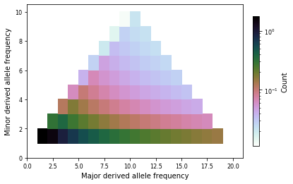

# Triallele statistic

An example of obtaining the sample triallelic frequency spectrum for a simple two epoch demography, with selection


```python
import time
time1 = time.time()

import dadi
import dadi.Triallele
import numpy as np, scipy, matplotlib
```


```python
sig1 = 0.0 # selection coefficient for first derived allele
sig2 = 0.0 # selection coefficient for second derived allele
theta1 = 1.
theta2 = 1.
misid = 0.0 # no ancestral misidentification
dts = [0.01, 0.025, 0.001] # time steps for integration
grid_pts = [40,60,80] # evaluate over these grid points, then extrapolate to $\Delta = 0$
ns = 20

T = 0.1 # equilibrium
#nu = lambda t: 1.0
#nuB = nuF = 1.0
nu = 2.0

fs = {}
for dt in dts:
    params = [nu,T]
    fs0 = dadi.Triallele.demographics.two_epoch(params, ns, grid_pts[0], sig1=sig1, sig2=sig2, theta1=theta1, theta2=theta2, misid=misid, dt=dt, folded = False)
    fs1 = dadi.Triallele.demographics.two_epoch(params, ns, grid_pts[1], sig1=sig1, sig2=sig2, theta1=theta1, theta2=theta2, misid=misid, dt=dt, folded = False)
    fs2 = dadi.Triallele.demographics.two_epoch(params, ns, grid_pts[2], sig1=sig1, sig2=sig2, theta1=theta1, theta2=theta2, misid=misid, dt=dt, folded = False)
    fs[dt] = dadi.Numerics.quadratic_extrap((fs0,fs1,fs2),(fs0.extrap_x,fs1.extrap_x,fs2.extrap_x))

tri_fs = dadi.Numerics.quadratic_extrap((fs[dts[0]],fs[dts[1]],fs[dts[2]]),(dts[0],dts[1],dts[2]))

#tri_fs = tri_fs.fold_major()

time2 = time.time()
print("total runtime = " + str(time2-time1))
```

    using numpy, not cython
    using numpy, not cython
    using numpy, not cython
    using numpy, not cython
    using numpy, not cython
    using numpy, not cython
    using numpy, not cython
    using numpy, not cython
    using numpy, not cython
    total runtime = 4.685603857040405


```python
## plot the triallele spectrum
import matplotlib.pylab as plt
dadi.Triallele.plotting.plot_single_trispectrum(tri_fs, folded=True, colorbar=True)
plt.show()
```




