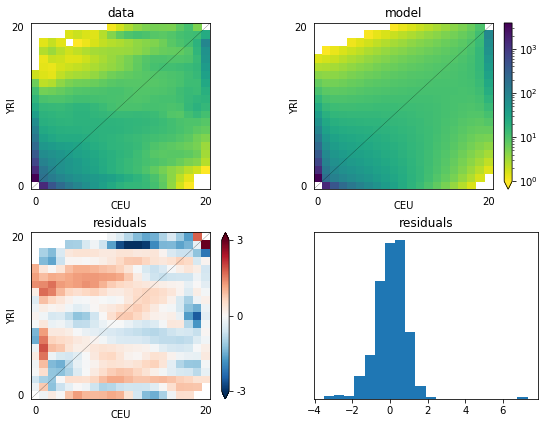

# Demography inference for YRI and CEU


```python
# Numpy is the numerical library dadi is built upon
import numpy as np
# NLopt is the optimization libary dadi uses
import nlopt
import dadi
```

### Define custom demography models


```python
# Define two custom demography models
def prior_onegrow_mig(params, ns, pts):
    """
    Model with growth, split, bottleneck in pop2, exp recovery, migration

    params list is
    nu1F: The ancestral population size after growth. (Its initial size is
          defined to be 1.)
    nu2B: The bottleneck size for pop2
    nu2F: The final size for pop2
    m: The scaled migration rate
    Tp: The scaled time between ancestral population growth and the split.
    T: The time between the split and present

    ns = (n1,n2): Size of fs to generate.
    pts: Number of points to use in grid for evaluation.
    """
    nu1F, nu2B, nu2F, m, Tp, T = params
    n1,n2 = ns
    # Define the grid we'll use
    xx = yy = dadi.Numerics.default_grid(pts)

    # phi for the equilibrium ancestral population
    phi = dadi.PhiManip.phi_1D(xx)
    # Now do the population growth event.
    phi = dadi.Integration.one_pop(phi, xx, Tp, nu=nu1F)

    # The divergence
    phi = dadi.PhiManip.phi_1D_to_2D(xx, phi)
    # We need to define a function to describe the non-constant population 2
    # size. lambda is a convenient way to do so.
    nu2_func = lambda t: nu2B*(nu2F/nu2B)**(t/T)
    phi = dadi.Integration.two_pops(phi, xx, T, nu1=nu1F, nu2=nu2_func, 
                                    m12=m, m21=m)

    # Finally, calculate the spectrum.
    sfs = dadi.Spectrum.from_phi(phi, (n1,n2), (xx,yy))
    return sfs

def prior_onegrow_nomig(params, ns, pts):
    """
    Model with growth, split, bottleneck in pop2, exp recovery, no migration

    params
    nu1F: The ancestral population size after growth. (Its initial size is
          defined to be 1.)
    nu2B: The bottleneck size for pop2
    nu2F: The final size for pop2
    Tp: The scaled time between ancestral population growth and the split.
    T: The time between the split and present

    ns = (n1,n2): Size of fs to generate.
    pts: Number of points to use in grid for evaluation.
    """
    nu1F, nu2B, nu2F, Tp, T = params
    return prior_onegrow_mig((nu1F, nu2B, nu2F, 0, Tp, T), ns, pts)
```

### Demography inference


```python
# Load the data
data = dadi.Spectrum.from_file('YRI_CEU.fs')
ns = data.sample_sizes

# These are the grid point settings will use for extrapolation.
pts_l = [40,50,60]

# The Demographics1D and Demographics2D modules contain a few simple models,
# mostly as examples. We could use one of those.
func = dadi.Demographics2D.split_mig
# Instead, we'll work with our custom model
func = prior_onegrow_mig

# Now let's optimize parameters for this model.

# The upper_bound and lower_bound lists are for use in optimization.
# Occasionally the optimizer will try wacky parameter values. We in particular
# want to exclude values with very long times, very small population sizes, or
# very high migration rates, as they will take a long time to evaluate.
# Parameters are: (nu1F, nu2B, nu2F, m, Tp, T)
upper_bound = [100, 100, 100, 10, 3, 3]
lower_bound = [1e-2, 1e-2, 1e-2, 0, 0, 0]

# This is our initial guess for the parameters, which is somewhat arbitrary.
p0 = [2,0.1,2,1,0.2,0.2]
# Make the extrapolating version of our demographic model function.
func_ex = dadi.Numerics.make_extrap_log_func(func)

# Perturb our parameters before optimization. This does so by taking each
# parameter a up to a factor of two up or down.
p0 = dadi.Misc.perturb_params(p0, fold=1, upper_bound=upper_bound,
                              lower_bound=lower_bound)
# Do the optimization. By default we assume that theta is a free parameter,
# since it's trivial to find given the other parameters. If you want to fix
# theta, add a multinom=False to the call.
# The maxiter argument restricts how long the optimizer will run. For real 
# runs, you will want to set this value higher (at least 10), to encourage
# better convergence. You will also want to run optimization several times
# using multiple sets of intial parameters, to be confident you've actually
# found the true maximum likelihood parameters.
print('Beginning optimization ************************************************')
popt = dadi.Inference.opt(p0, data, func_ex, pts_l, 
                          lower_bound=lower_bound,
                          upper_bound=upper_bound,
                          verbose=len(p0), maxiter=3)
# The verbose argument controls how often progress of the optimizer should be
# printed. It's useful to keep track of optimization process.
print('Finshed optimization **************************************************')
```

    Beginning optimization ************************************************
    6       , -1340.65    , array([ 2.5962     ,  0.0600621  ,  2.5742     ,  1.66927    ,  0.140086   ,  0.113249   ])
    12      , -1694.58    , array([ 1.86188    ,  0.0371463  ,  1.88585    ,  0.782093   ,  0.145142   ,  0.122633   ])
    18      , -1160.3     , array([ 2.3069     ,  0.0506161  ,  2.30473    ,  1.2742     ,  0.141862   ,  0.116498   ])
    24      , -1160.58    , array([ 2.3069     ,  0.0506161  ,  2.30473    ,  1.2742     ,  0.141862   ,  0.116615   ])
    30      , -1382.55    , array([ 1.34939    ,  0.0664064  ,  2.07379    ,  0.837229   ,  0.151893   ,  0.0676783  ])
    36      , -1097.16    , array([ 1.93709    ,  0.0553532  ,  2.2268     ,  1.11089    ,  0.145055   ,  0.0976047  ])
    42      , -1938.18    , array([ 1.04933    ,  0.179163   ,  1.46889    ,  0.823848   ,  0.53017    ,  0.297989   ])
    48      , -1939.01    , array([ 1.04933    ,  0.179163   ,  1.46889    ,  0.823848   ,  0.53017    ,  0.298287   ])
    54      , -1090.56    , array([ 1.84104    ,  0.0609628  ,  2.15124    ,  1.08476    ,  0.161522   ,  0.107074   ])
    Finshed optimization **************************************************


```python
# These are the actual best-fit model parameters, which we found through
# longer optimizations and confirmed by running multiple optimizations.
# We'll work with them through the rest of this script.
popt = [1.880, 0.0724, 1.764, 0.930, 0.363, 0.112]
print('Best-fit parameters: {0}'.format(popt))

# Calculate the best-fit model AFS.
model = func_ex(popt, ns, pts_l)
# Likelihood of the data given the model AFS.
ll_model = dadi.Inference.ll_multinom(model, data)
print('Maximum log composite likelihood: {0}'.format(ll_model))
# The optimal value of theta given the model.
theta = dadi.Inference.optimal_sfs_scaling(model, data)
print('Optimal value of theta: {0}'.format(theta))

# Plot a comparison of the resulting fs with the data.
import pylab
pylab.figure(figsize=(8,6))
dadi.Plotting.plot_2d_comp_multinom(model, data, vmin=1, resid_range=3,
                                    pop_ids =('YRI','CEU'), show=False)
# Save the figure
pylab.savefig('YRI_CEU.png', dpi=250)
```

    Best-fit parameters: [1.88, 0.0724, 1.764, 0.93, 0.363, 0.112]
    Maximum log composite likelihood: -1066.2652456574913
    Optimal value of theta: 2743.963580382426





### Generating data with *ms*


```python
def prior_onegrow_mig_mscore(params):
    """
    ms core command corresponding to prior_onegrow_mig
    """
    nu1F, nu2B, nu2F, m, Tp, T = params
    # Growth rate
    alpha2 = np.log(nu2F/nu2B)/T

    command = "-n 1 %(nu1F)f -n 2 %(nu2F)f "\
            "-eg 0 2 %(alpha2)f "\
            "-ma x %(m)f %(m)f x "\
            "-ej %(T)f 2 1 "\
            "-en %(Tsum)f 1 1"

    # There are several factors of 2 necessary to convert units between dadi
    # and ms.
    sub_dict = {'nu1F':nu1F, 'nu2F':nu2F, 'alpha2':2*alpha2,
                'm':2*m, 'T':T/2, 'Tsum':(T+Tp)/2}

    return command % sub_dict

# Let's generate some data using ms, if you have it installed.
mscore = prior_onegrow_mig_mscore(popt)
# I find that it's most efficient to simulate with theta=1, average over many
# iterations, and then scale up.
mscommand = dadi.Misc.ms_command(1., ns, mscore, int(1e5))
# If you have ms installed, uncomment these lines to see the results.

# We use Python's os module to call this command from within the script.
import os
return_code = os.system('{0} > test.msout'.format(mscommand))
# We check the return code, so the script doesn't crash if you don't have ms
# installed
if return_code == 0:
    msdata = dadi.Spectrum.from_ms_file('test.msout')
    pylab.figure(2)
    dadi.Plotting.plot_2d_comp_multinom(model, theta*msdata, vmin=1,
                                        pop_ids=('YRI','CEU'), show=False)
```

### Uncertainty analysis with GIM


```python
# Estimate parameter uncertainties using the Godambe Information Matrix, to
# account for linkage in the data. 
import dadi.Godambe

# To use the GIM approach, we need to have spectra from bootstrapping our 
# data.  Let's load the ones we've provided for the example.  
# (We're using Python list comprehension syntax to do this in one line.)
all_boot = [dadi.Spectrum.from_file('bootstraps/{0:02d}.fs'.format(ii)) 
            for ii in range(100)]
uncerts = dadi.Godambe.GIM_uncert(func_ex, pts_l, all_boot, popt, data, 
                                  multinom=True)
# uncert contains the estimated standard deviations of each parameter, with
# theta as the final entry in the list.
print('Estimated parameter standard deviations from GIM: {0}'.format(uncerts))

# For comparison, we can estimate uncertainties with the Fisher Information
# Matrix, which doesn't account for linkage in the data and thus underestimates
# uncertainty. (Although it's a fine approach if you think your data is truly
# unlinked.)
uncerts_fim = dadi.Godambe.FIM_uncert(func_ex, pts_l, popt, data, multinom=True)
print('Estimated parameter standard deviations from FIM: {0}'.format(uncerts_fim))

print('Factors by which FIM underestimates parameter uncertainties: {0}'.format(uncerts/uncerts_fim))

# What if we fold the data?
# These are the optimal parameters when the spectrum is folded. 
popt_fold = [1.910, 0.074, 1.787, 0.914, 0.439, 0.114]
all_boot_fold = [_.fold() for _ in all_boot]
uncerts_folded = dadi.Godambe.GIM_uncert(func_ex, pts_l, all_boot_fold,
                                         popt_fold, data.fold(), multinom=True)
print('Folding increases parameter uncertainties by factors of: {0}'.format(uncerts_folded/uncerts))
```

    If you use the Godambe methods in your published research, please cite Coffman et al. (2016) in addition to the main dadi paper Gutenkunst et al. (2009).
    AJ Coffman, P Hsieh, S Gravel, RN Gutenkunst "Computationally efficient composite likelihood statistics for demographic inference" Molecular Biology and Evolution 33:591-593 (2016)
    Estimated parameter standard deviations from GIM: [2.38244007e-01 1.15613754e-02 5.76362720e-01 2.31842997e-01
     2.61251046e-01 1.73376571e-02 4.16848034e+02]
    Estimated parameter standard deviations from FIM: [5.23356942e-02 7.92714622e-03 3.05395587e-01 7.71624912e-02
     5.24699875e-02 7.21898103e-03 5.92540673e+01]
    Factors by which FIM underestimates parameter uncertainties: [4.55222789 1.45845365 1.88726604 3.00460746 4.97905677 2.40167651
     7.03492694]
    Folding increases parameter uncertainties by factors of: [0.74660034 0.97819402 0.77819968 0.81708865 0.81143438 0.8851766
     0.77560501]


### Likelihood ratio test


```python
# Let's do a likelihood-ratio test comparing models with and without migration.
# The no migration model is implemented as prior_onegrow_nomig
func_nomig = prior_onegrow_nomig
func_ex_nomig = dadi.Numerics.make_extrap_log_func(func_nomig)
# These are the best-fit parameters, which we found by multiple optimizations
popt_nomig = np.array([ 1.897,  0.0388,  9.677,  0.395,  0.070])
model_nomig = func_ex_nomig(popt_nomig, ns, pts_l)
ll_nomig = dadi.Inference.ll_multinom(model_nomig, data)

# Since LRT evaluates the complex model using the best-fit parameters from the
# simple model, we need to create list of parameters for the complex model
# using the simple (no-mig) best-fit params.  Since evalution is done with more
# complex model, need to insert zero migration value at corresponding migration
# parameter index in complex model. And we need to tell the LRT adjust function
# that the 3rd parameter (counting from 0) is the nested one.
p_lrt = [1.897,  0.0388,  9.677, 0, 0.395,  0.070]

adj = dadi.Godambe.LRT_adjust(func_ex, pts_l, all_boot, p_lrt, data, 
                              nested_indices=[3], multinom=True)
D_adj = adj*2*(ll_model - ll_nomig)
print('Adjusted D statistic: {0:.4f}'.format(D_adj))

# Because this is test of a parameter on the boundary of parameter space 
# (m cannot be less than zero), our null distribution is an even proportion 
# of chi^2 distributions with 0 and 1 d.o.f. To evaluate the p-value, we use the
# point percent function for a weighted sum of chi^2 dists.
pval = dadi.Godambe.sum_chi2_ppf(D_adj, weights=(0.5,0.5))
print('p-value for rejecting no-migration model: {0:.4f}'.format(pval))

# This ensures that the figures pop up. It may be unecessary if you are using
# ipython.
pylab.show()
```

    Adjusted D statistic: 4.1874
    p-value for rejecting no-migration model: 0.0204

