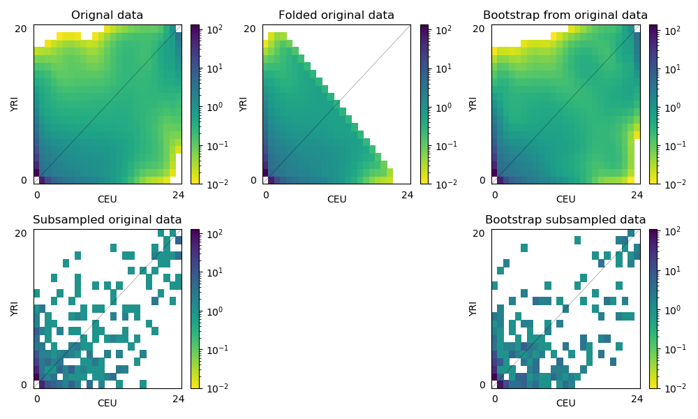

# Frequency spectrum from data

Extracting a frequency spectrum from a VCF file and generating bootstrap samples

```python
import dadi
```

```python
# Parse the VCF file to generate a data dictionary
datafile = '1KG.YRI.CEU.biallelic.synonymous.snps.withanc.strict.subset.vcf.gz'
dd = dadi.Misc.make_data_dict_vcf(datafile, '1KG.YRI.CEU.popfile.txt')
```

```python
# Extract the spectrum for ['YRI','CEU'] from that dictionary, with 
# YRI projected down to 20 and CEU projected down to 24.
# We project down like this just to make fitting faster. For a real analysis
# we would not project so severely.
pop_ids, ns = ['YRI','CEU'], [20,24]
fs = dadi.Spectrum.from_data_dict(dd, pop_ids, ns)
```

```python
# We can save our extracted spectrum to disk
fs.to_file('1KG.YRI.CEU.biallelic.synonymous.snps.withanc.strict.subset.fs')
```

```python
# If we didn't have outgroup information, we could fold the fs.
fs_folded = dadi.Spectrum.from_data_dict(dd, pop_ids, ns, polarized=False)
```

```python
# Generate 100 bootstrap datasets, by dividing the genome into 2 Mb chunks and
# resampling from those chunks.
Nboot, chunk_size = 100, 2e6
chunks = dadi.Misc.fragment_data_dict(dd, chunk_size)
boots = dadi.Misc.bootstraps_from_dd_chunks(chunks, Nboot, pop_ids, ns)
```

```python
# If you're modeling inbreeding, you cannot project your data downward. Instead,
# to deal with missing data we subsample individuals in the VCF file.
# If we're modeling inbreeding, it is important that we *never* project downward,
# as this destroys the genotype information.
dd_subsample = dadi.Misc.make_data_dict_vcf(datafile, '1KG.YRI.CEU.popfile.txt',
                                            subsample={'YRI': ns[0]//2, 'CEU': ns[1]//2})
fs_subsample = dadi.Spectrum.from_data_dict(dd_subsample, pop_ids, ns)
# Bootstrapping with subsampling is more computationally expensive, 
# because we must repeatedly access the VCF file to subsample.
boots_subsample = dadi.Misc.bootstraps_subsample_vcf(datafile, '1KG.YRI.CEU.popfile.txt',
                                                     subsample={'YRI': ns[0]//2, 'CEU': ns[1]//2}, Nboot=2, 
                                                     chunk_size=chunk_size, pop_ids=pop_ids)
```

```python
# Plot comparing the multiple versions of our data spectra.
import matplotlib.pyplot as plt

fig = plt.figure(1, figsize=(10,6))
fig.clear()

# Note that projection creates fractional entries in the spectrum,
# so vmin < 1 is sensible.
ax = fig.add_subplot(2,3,1)
dadi.Plotting.plot_single_2d_sfs(fs, vmin=1e-2, ax=ax)
ax.set_title('Orignal data')

ax = fig.add_subplot(2,3,2)
dadi.Plotting.plot_single_2d_sfs(fs_folded, vmin=1e-2, ax=ax)
ax.set_title('Folded original data')

ax = fig.add_subplot(2,3,3)
dadi.Plotting.plot_single_2d_sfs(boots[0], vmin=1e-2, ax=ax)
ax.set_title('Bootstrap from original data')

# Subsampling does not create those fractional entries.
ax = fig.add_subplot(2,3,4)
dadi.Plotting.plot_single_2d_sfs(fs_subsample, vmin=1e-2, ax=ax)
ax.set_title('Subsampled original data')

ax = fig.add_subplot(2,3,6)
dadi.Plotting.plot_single_2d_sfs(boots_subsample[0], vmin=1e-2, ax=ax)
ax.set_title('Bootstrap subsampled data')

fig.tight_layout()
plt.show()
```

