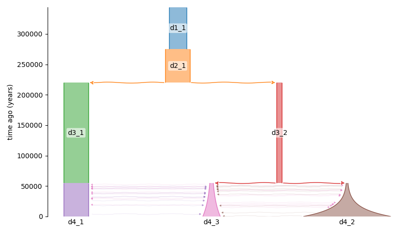
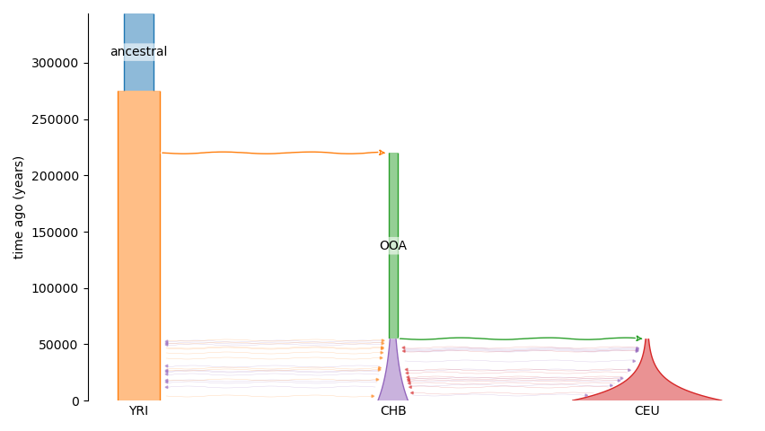
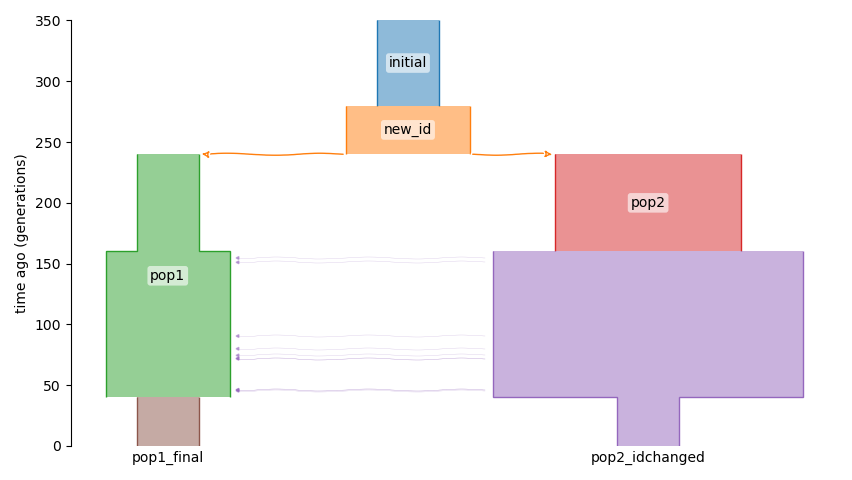

# Working with Demes files

Demes is a standardized and human-readable file format for representing demographic models[11](./references.md), enabling interfacing between tools and (with [demesdraw](https://github.com/grahamgower/demesdraw)) visual representation of models.
dadi supports both simulating SFS from Demes files and exporting dadi models into Demes files.

## Calculating SFS from Demes files

The SFS corresponding to a Demes file can be easily calculated.

    model_file = '../../tests/demes/gutenkunst_ooa.yaml'
    sampled_demes = ['YRI', 'CHB', 'CEU']
    sample_sizes = [10, 10, 10]
    pts_l = [20,30,40]

    fs_demes = dadi.Spectrum.from_demes(model_file, sampled_demes=sampled_demes, sample_sizes=sample_sizes, pts=pts_l)

## Exporting Demes files corresponding to dadi models

Every time a dadi model is run, the information required to export a Demes version of the model is recorded. The function `dadi.Demes.output` then returns the corresponding Demes graph. If supplied, the reference population size and generation time will be recorded in the Demes graph as well.

    params = (1.4, 0.3, 0.1, 5, 0.2, 1, 0, 0, 0.2, 0.1, 0.1, 0.3, 0.1)
    ns, pts = (2,2,2), 10
    fs = dadi.Demographics3D.out_of_africa(params, ns, pts)
    g = dadi.Demes.output(Nref=11000, generation_time=25)

The `demes` library can be used to save the graph to a file, or `demesdraw` can be used to visualize the model. 

    import demes
    g.description = 'Example of demes output from dadi'
    demes.dump(g, 'example.yaml')

    import demesdraw
    ax = demesdraw.tubes(g)
    ax.figure.savefig('out_of_africa_defaultnames.png')

Default deme identifiers are assigned, which change along the population history. 
To assign more useful identifiers use the `deme_mapping` argument.

    g = dadi.Demes.output(Nref=11000, generation_time=25,
                          deme_mapping={'ancestral':['d1_1'], 'YRI':['d2_1','d3_1','d4_1'], 'OOA':['d3_2'], 'CEU':['d4_2'], 'CHB':['d4_3']})
    ax = demesdraw.tubes(g)
    ax.figure.savefig('out_of_africa_renamed.png')

Deme identifiers can also be specified directly within a dadi model function. To do so, use the `deme_ids` argument in _all_ methods for integration and creating new populations.

    from dadi import Numerics, PhiManip, Integration, Spectrum
    def named_model(params, ns, pts):
        xx = Numerics.default_grid(pts)
        phi = PhiManip.phi_1D(xx, deme_ids=['initial'])
        phi = Integration.one_pop(phi, xx, 0.1, nu=2, deme_ids=['new_id'])
        phi = PhiManip.phi_1D_to_2D(xx, phi, deme_ids=['pop1','pop2'])
        phi = Integration.two_pops(phi, xx, 0.2, nu1=1, nu2=3, deme_ids=['pop1','pop2'])
        phi = Integration.two_pops(phi, xx, 0.3, nu1=2, nu2=5, m12=0.5, deme_ids=['pop1','pop2_idchanged'])
        phi = Integration.two_pops(phi, xx, 0.1, nu1=1, nu2=1, deme_ids=['pop1_final', 'pop2_idchanged'])
        fs = Spectrum.from_phi(phi, ns, (xx, xx))
        return fs

    fs = named_model(None, (1,1), 10)
    g = dadi.Demes.output(Nref=200)
    ax = demesdraw.tubes(g)
    ax.figure.savefig('named_model.png')

