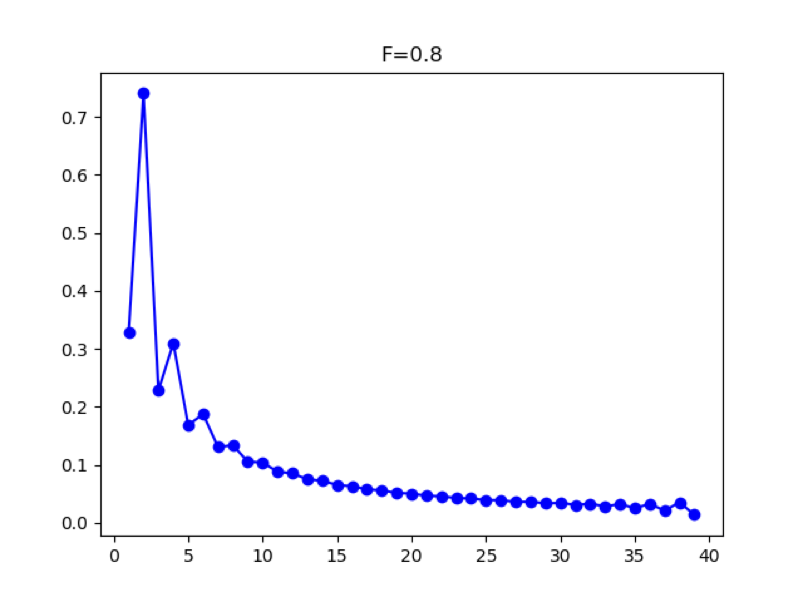

# Inbreeding

When populations are inbred, the excess homozygosity can distort the SFS such that the even entries are greater than the odd entries for a population. For high levels of inbreeding (*FIS* ≈ 0.5 or higher), this will generate frequency spectra with a conspicuous pattern of zig-zagging up and down between adjacent entries. However, lower levels of inbreeding can still bias estimates of demography despite not having such a dramatic effect on the SFS.

<strong>Figure 7 SFS with Inbreeding:</strong> <i>F<i>IS</i></i> = 0.8.

To accommodate this, inbreeding can be estimated as part of a demographic model by using the `from_phi_inbreeding` function in the `Spectrum` class. This can be done by including additional parameters for the inbreeding coefficients (one for each population) in the model and passing them to the `from_phi_inbreeding` function in the demographic model:

	def snm_inbreeding(params, ns, pts):
		F = params[0]
		xx = dadi.Numerics.default_grid(pts)
		phi = dadi.PhiManip.phi_1D(xx)
		fs = dadi.Spectrum.from_phi_inbreeding(phi, ns, (xx,), (F,), (2,))

		return fs

<strong>Listing 9 Inbreeding</strong>: Standard neutral model for a diploid population with inbreeding level <code>F</code>

The `from_phi_inbreeding` function also requires the ploidy levels of the populations being analyzed, so it can naturally handle autopolyploids as well:

	def iso_inbreeding(params, ns, pts):
		T, nuA, nuB, F1, F2 = params
		xx = dadi.Numerics.default_grid(pts)
		phi = dadi.PhiManip.phi_1D(xx)
		phi = dadi.PhiManip.phi_1D_to_2D(xx, phi)
		phi = phi.Integration.two_pops(phi, xx, T, nu1, nu2)
		fs = dadi.Spectrum.from_phi_inbreeding(phi, ns, (xx, xx), (F1, F2), (2, 4))

		return fs

<strong>Listing 10 Diploid-Tetraploid Isolation Model</strong>: An ancestral population splits at time <code>T</code> into a diploid (pop 1) and autotetraploid (pop 2) population of sizes <code>nu1</code> and <code>nu2</code>, respectively. The populations have separate inbreeding coefficients <code>F1</code> and <code>F2</code>

One important thing to note about modeling inbred individuals is that <strong>you cannot use projection on your data</strong>.
Because inbreeding is manifested as excess homozygosity in an individuals genome, we need to make sure that the effects of
inbreeding aren't erased by randomly sampling chromosomes from the population. If you are starting with a VCF file,
there is now a function to read in data from that file to make a frequency spectrum while also allowing for subsampling
individuals. This is the preferred way to downsample individuals, especially in the case when there is inbreeding.
