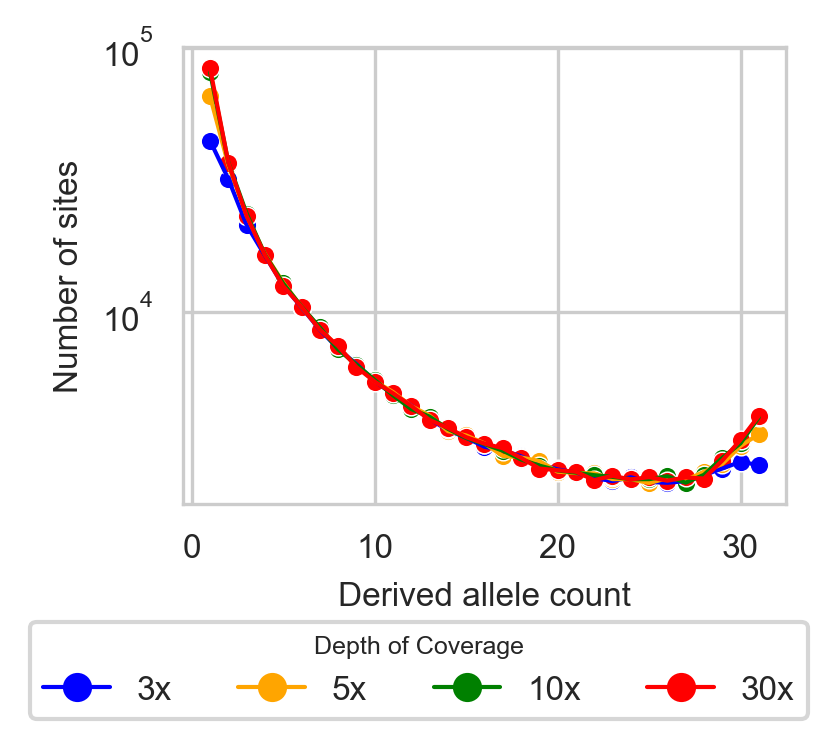

# Low-Pass Sequencing

To address the impact of low-pass sequencing on the Allele Frequency Spectrum (AFS), we developed a probabilistic model of low-pass biases from the Genome Analysis Toolkit (GATK) multi-sample calling pipeline that corrects for biases, particularly the loss of low-frequency variants and the misidentification of heterozygotes as homozygotes. These biases lead to fewer observed variant sites and skewed AFS ([Figure 1](LowPassSFS.png)). Our model calculates the probabilities of correctly calling variable sites, subsampling individuals, and estimating allele frequencies with higher accuracy.

The model considers a site as variant if at least two alternate allele reads are detected. Individuals are classified as missing if no reads are observed, homozygous if all reads match one allele, and heterozygous if reads for both alleles are present. The model then calculates the probability of misidentifying heterozygotes and adjusts allele frequencies accordingly. Subsampling is used to generate an AFS when not all individuals have been called.

In inbred populations, where homozygosity is elevated, the model accounts for these effects by incorporating a user-defined inbreeding coefficient \(F\), which represents the reduction in heterozygosity across the population. This coefficient is provided as a single value that reflects the overall level of inbreeding. When applying low-pass bias correction for inbred populations, users must initially specify an inbreeding coefficient. However, during optimization, they may iteratively adjust this value to refine the model's accuracy. Our simulations with moderate inbreeding (F = 0.5) demonstrated that if the initial inbreeding coefficient is underestimated, the optimization process tends to infer larger inbreeding values. Conversely, overestimating the coefficient results in smaller inferred values. A substantial discrepancy between the inbreeding coefficient used in the correction and the value inferred during optimization indicates that the initial assumption was suboptimal. Therefore, users should iteratively update the inbreeding coefficient in the low-pass model, refining the estimate with each iteration until the best possible inference is achieved.



<p align="center"><b>Figure 1:</b> SFS from various depths of coverage: high (30x), medium (10x), and low (5x and 3x).</p>

### Usage

```python
make_low_pass_func_GATK_multisample(func, cov_dist, nseq, nsub, sim_threshold=1e-2, Fx=[0])
```

- **demo_model**: Specified demographic model in *dadi*.
- **cov_dist**: coverage distribution information calculated using the LowPass.compute_cov_dist function.
- **nseq**: Sequenced sample size (in haplotypes).
- **nsub**: Final sample size (in haplotypes).
- **sim_threshold**: This method switches between analytic and simulation-based methods. 
  - Setting this threshold to `0` will always use simulations, 
  - Setting it to `1` will always use analytics. 
  - Values in between indicate that simulations will be employed for thresholds below that value.
- **Fx**: Inbreeding coefficient. A single value or a sequence of values representing the inbreeding levels for different parts of the genome.

#### Define the demographic model (exponential growth)
```python
demo_model = dadi.Numerics.make_extrap_func(dadi.Demographics1D.growth)
```

#### Wrap the demographic model with low-pass model
```python
demo_model_lp = LowCoverage.make_low_cov_func(demo_model, dd, pop_ids, nseq, nsub, sim_threshold=1e-2, Fx=[0])
```

# Low-Pass Sequencing Pipeline Example

### Overview

A pipeline example for low-pass sequencing at 3x coverage depth, detailing each step from loading necessary modules and importing data to performing demographic inference and visualizing results.

```python
# Load Required Modules
import dadi  # Demographic Analysis with dadi
from dadi.LowPass import LowPass  # Low-pass sequencing tools in dadi
import nlopt  # Non-linear optimization library
import matplotlib.pyplot as plt  # Plotting library for visualization

# Define Input Files
datafile = './low-pass-example-3x.vcf.gz'
popfile = './low-pass-popfile-3x.txt'

# Create Data Dictionary
data_dict = dadi.Misc.make_data_dict_vcf(datafile, popfile, subsample={'pop1': 16}, calc_coverage=True)

# Set Outgroup Allele and Context
for chrom_pos in data_dict:
    data_dict[chrom_pos]['outgroup_allele'] = data_dict[chrom_pos]['segregating'][0]
    data_dict[chrom_pos]['outgroup_context'] = data_dict[chrom_pos]['segregating'][0]

# Generate Site Frequency Spectrum (SFS)
data_fs = dadi.Spectrum.from_data_dict(data_dict, ['pop1'], [32])

# Calculate Coverage Distribution
cov_dist = LowPass.compute_cov_dist(data_dict, data_fs.pop_ids)

# Define the Demographic Model and Integrate it with the Low-Pass Function
demo_model_ex = dadi.Numerics.make_extrap_func(dadi.Demographics1D.growth)
demo_model_ex = LowPass.make_low_pass_func_GATK_multisample(demo_model_ex, cov_dist, data_fs.pop_ids, [40], [32], 1e-2)

# Set Grid Points for Analysis
pts_l = [max(data_fs.sample_sizes)+20, max(data_fs.sample_sizes)+30, max(data_fs.sample_sizes)+40]

# Initialize Parameters and Optimization Boundaries
params = [1, 0.01]
lower_bounds = [1e-2, 1e-3]
upper_bounds = [100, 3]

# Perturb Parameters
p0 = dadi.Misc.perturb_params(params, fold=1, upper_bound=upper_bounds, lower_bound=lower_bounds)

# Run Optimization
# It is recommended to optimize the model at least 100 times
popt, ll_model = dadi.Inference.opt(p0, data_fs,demo_model_ex, pts_l, lower_bound=lower_bounds, upper_bound=upper_bounds, maxeval=600, verbose=0)

# Calculate Synonymous Theta
model_fs = demo_model_ex(popt, data_fs.sample_sizes, pts_l)
theta0 = dadi.Inference.optimal_sfs_scaling(model_fs, data_fs)

# Plot Demographic Model Results
dadi.Plotting.plot_1d_comp_multinom(model_fs, data_fs)
```

**Notes**:
- When working with low-pass sequencing data, avoid projecting down the data, as this can distort AFS estimates due to an excess of homozygosity. Instead, use subsampling methods to maintain data integrity and reflect the original AFS accurately.
- When creating the data dictionary, ensure that `calc_coverage=True` is set to include coverage information.