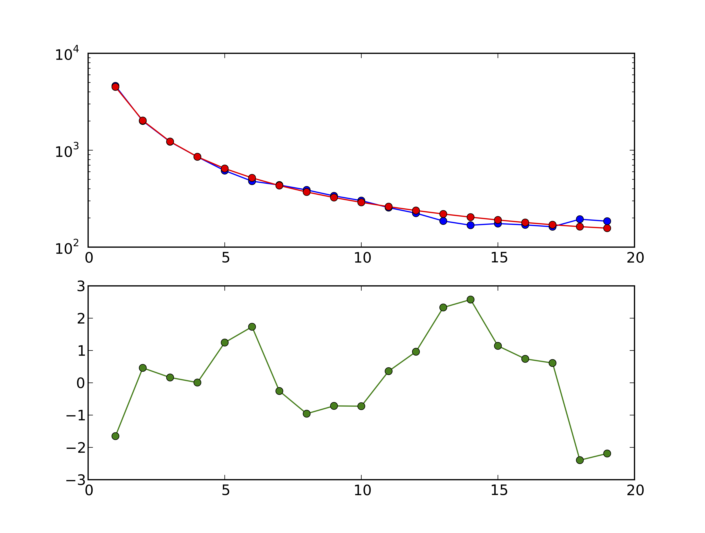
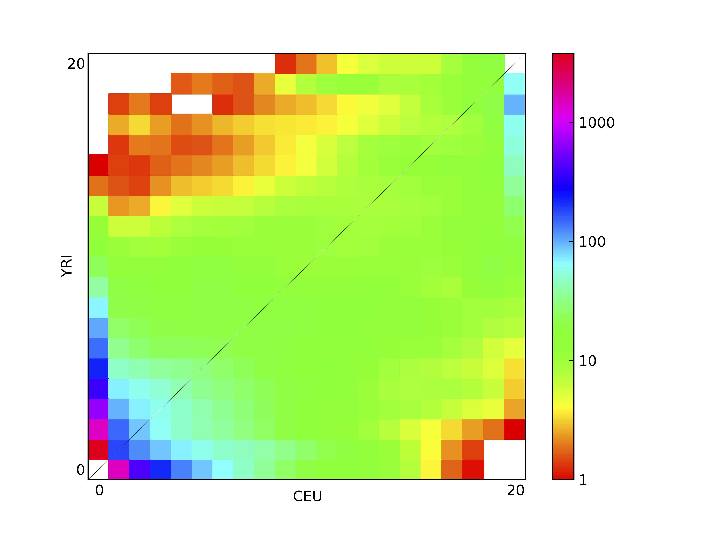
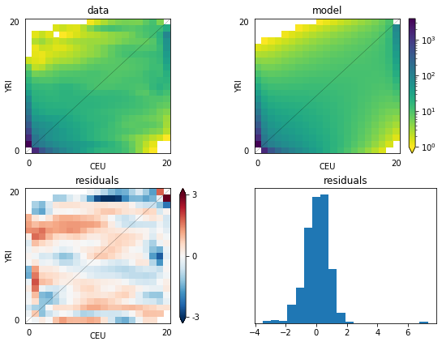
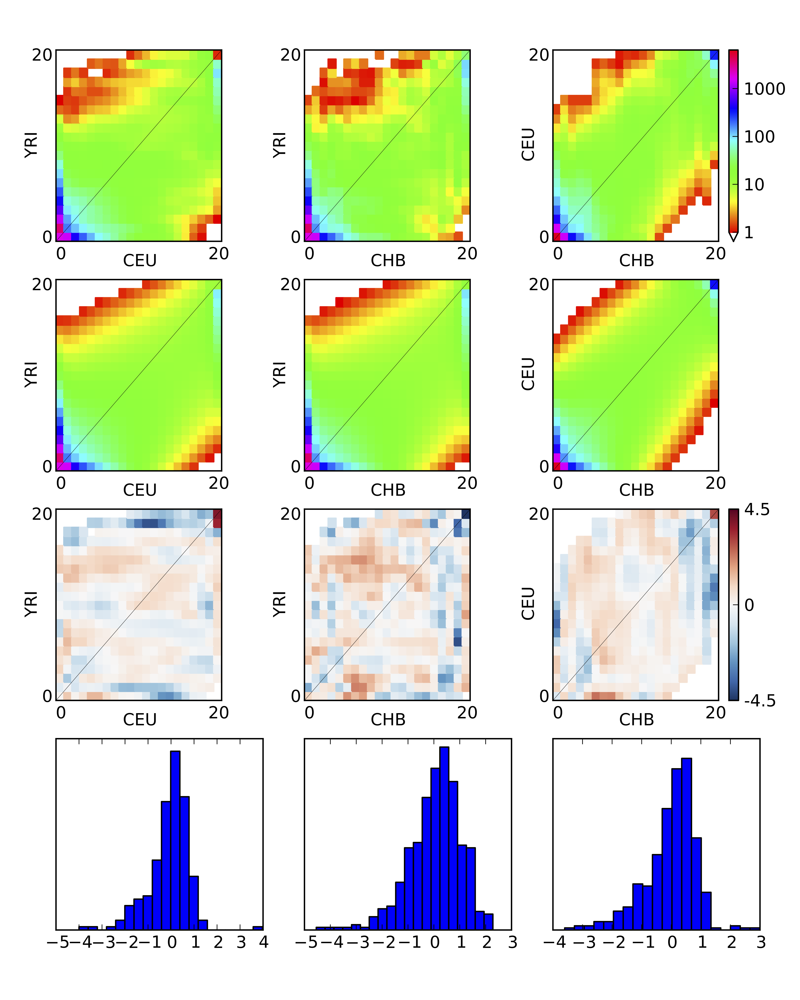

# Plotting

For your convenience, dadi provides several plotting methods. These all require installation of the Python library `matplotlib`.

### Essential matplotlib commands

To access additional, more general, methods for manipulating plots

	import matplotlib.pyplot as pyplot

In particular, the method `pyplot.figure()` will creat a new empty figure.

One quirk of `matplotlib` is that your plots may not show up immediately upon calling the plotting commands. If they don't, a call to `pyplot.show()` will pop them up. If you are not running in IPython, this will cause Python to block, so do not place it in scripts you run from the command-line, unless it is the last line.

### 1D comparison

<strong>Figure 3 1D model-data comparison plot:</strong> In the top panel, the model is plotted in red and the data in blue. In the bottom panel, the residuals between model and data are plotted.

`dadi.Plotting.plot_1d_comp_Poisson` and `dadi.Plotting.plot_1d_comp_multinomial` plot a comparison between a one-dimensional model and data FS. In the `_multinomial` method, the model is optimally scaled to match the data. The plot is illustrated in above. The top plot shows the model and data frequency spectra, while the bottom shows the residuals between model and data. A positive residuals means the model predicts too many SNPs in that entry. For an explanation of the residuals, see the Residuals section.

### 2D spectra

<strong>Figure 4 2D FS plot:</strong> Each entry in the FS is colored according to the logarithm of the number of variants within it.

`dadi.Plotting.plot_single_2d_sfs` will plot a single two-dimensional frequency spectrum, as a logarithmic colormap. Each entry in the FS is colored according to the logarithm of the number of variants within it. This is illustrated above, which is the result of 

	dadi.Plotting.plot_single_2d_sfs(data, vmin = 1)

Here `vmin` indicates the minimum value to plot, because in  a logarithmic plot 0 in the FS maps to minus infinity, which causes great difficulty in plotting. Entires below the minimum (and masked entries) are plotted as white.

### 2D comparison

<strong>Figure 5 2D model-data comparison plot:</strong> The upper-left panel is the data, and the upper-right is the model. The lower two panels plot the residuals, and a histogram of the residuals.

`dadi.Plotting.plot_2d_comp_Poisson` and `dadi.Plotting.plot_2d_comp_multinomial` plot comparisons between 2D models and data.
The upper-left panel is the data, and the upper-right is the model. The lower two panels plot the residuals, and a histogram of the residuals.

### 3D spectra

Unfortunately, nice portable 3D plotting is difficult in Python. We have developed a Mathematica script that will do such plotting (as in Fig. 2(A) of [3](./references.md)) Please contact the authors on `dadi-user`, and we will send you a copy.

### 3D comparison

<strong>Figure 6 3D model-data comparison plot</strong>

`dadi.Plotting.plot_3d_comp_Poisson` and `dadi.Plotting.plot_3d_comp_multinomial` plot comparisons between 3D models and data. The comparison is based on the three 2D marginal spectra.

### Residuals

The residuals are the properly normalized differences between model and data. Normalization is necessary, because the expected variance in each entry increase with the expected value of that entry. Two typpes of residuals are supported, Poisson and Ansocombe.

The Poisson residual is simply

$$\text{residual} = (\text{model} - \text{data})/\sqrt{\text{model}}$$

Note, however, that this residual is not normally distributed when the expected value (model entry) is small.

The Anscombe residual is

$$\text{residual} = \frac{3}{2} \frac{(\text{model}^{\frac{2}{3}}-\text{model}^{-\frac{1}{3}}/9)-(\text{data}^{\frac{2}{3}}-\text{data}^{-\frac{1}{3}}/9)}{\text{model}^{\frac{1}{6}}}$$
