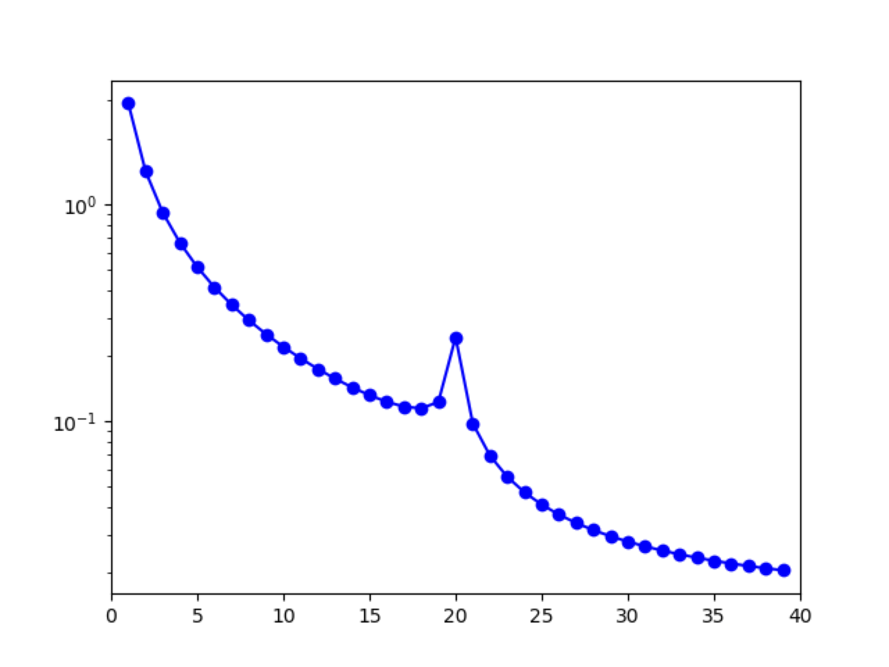

# Polyploid Subgenomes

To model polyploid lineages, a demographic model for their subgenomes can be created. This is done by treating the subgenomes as analogous to populations, and then combining their frequency spectra into a single, polyploid SFS. Including a migration parameter between the subgenomes can act as a proxy for allelic exchange (homoeologous recombination), which allows both autopolyploids and allopolyploids to be modeled. The input for a single polyploid lineage is a one-dimensional SFS, so there is no need to predetermine if the lineage is auto- or allopolploid. There is also no need to try and separate SNP calls between subgenomes because fixed heterozygosity is naturally accommodated by this model.

<strong>Figure 8 Tetraploid SFS:</strong> <i>F<i>IS</i></i> = 0.8.

	def two_subgenomes(params, ns, pts):
		T, m = params
		xx = dadi.Numerics.default_grid(pts)
		phi = dadi.PhiManip.phi_1D(xx)
		phi = dadi.PhiManip.phi_1D_to_2D(xx, phi)
		phi = dadi.Integration.two_pops(phi, xx, T, 1.0, 1.0, m, m)
		fs = dadi.Spectrum.from_phi(phi, ns, (xx, xx))
		fs2 = dadi.Spectrum(dadi.Misc.combine_pops(fs))
		
		return fs2

<strong>Listing 11 Two subgenomes</strong>: At time <code>T</code> in the past, an equilibrium population duplicates (autopolyploidy) and the subgenomes exchange genes symmetrically at a rate of <code>m</code>. The SFS for the subgenomes are then combined with the <code>combine_pops</code> function to create a single, polyploid SFS

