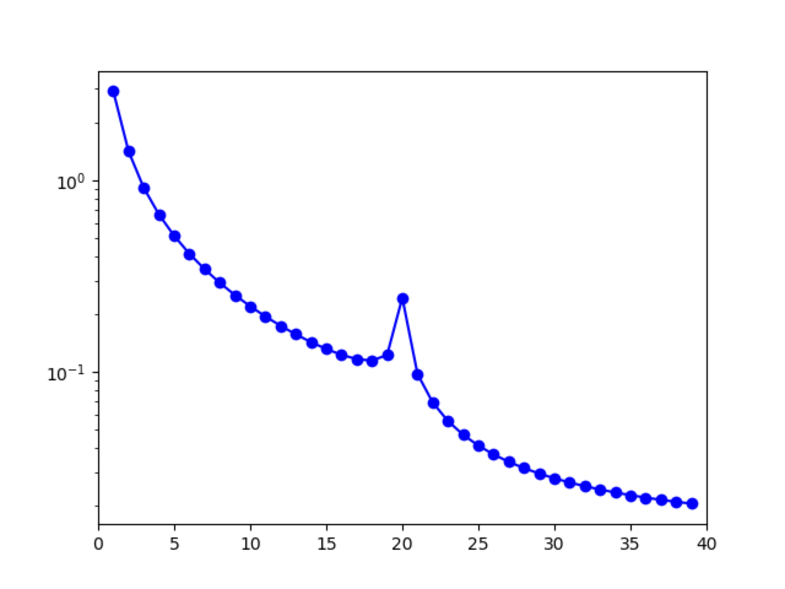

# Polyploidy

dadi provides support for demographic models with homoeologous exchange and selection for auto- and allopolyploids by treating each subgenome in the polyploid lineage as a separate population. Below, we outline key differences and considerations when using dadi to model polyploids. Brief examples are provided for auto- and allotetraploids with more complex examples given in (TODO: add path/link to polyploid examples.)

### Specifying a Polyploid Model

Defining a demographic model for a polyploid population is very similar to defining a standard dadi demographic model with two key differences. First, the integration functions in `dadi.Polyploidy.Integration` must be used in place of the standard `dadi.Integration` functions (although virtually all other dadi functions including those in `dadi.Numerics` and `dadi.PhiManip` can be used without modification).

Second, the ploidy of each subgenome/population must be specified during each integration by setting the `ploidyflag` parameter using the `PloidyType` class in `dadi.Polyploidy.Integration`. For example, to model a simple two-epoch model for an autotetraploid population, we would use the following model function from `dadi.Polyploidy.auto_demographics.two_epoch`:

	def two_epoch_autotetraploid(params, ns, pts):
    	T_WGD, nu = params
    	xx = Numerics.default_grid(pts)

		autoflag = Polyploidy.PloidyType.AUTO

    	phi = PhiManip.phi_1D(xx)
    	phi = PolyInt.one_pop(phi, xx, T_WGD, nu=nu, ploidyflag=autoflag)
    	fs = Spectrum.from_phi(phi, ns, (xx,))
    	
		return fs

A similar model for an allotetraploid (which also includes a divergence period between the two diploid progenitors) could be specified as: 

	def two_epoch_allotetraploid(params, ns, pts):

    	T_div, T_WGD, nu = params
    	xx = Numerics.default_grid(pts)

    	alloaflag = Polyploidy.Integration.PloidyType.ALLOa
    	allobflag = Polyploidy.Integration.PloidyType.ALLOb
    
    	phi = PhiManip.phi_1D(xx)
    	phi = PhiManip.phi_1D_to_2D(xx, phi)
    	
		# integration for the diploid progenitors diverging
    	phi = Polyploidy.Integration.two_pops(phi, xx, T_div)

    	# then, integration for the allotetraploid formation
    	phi = PolyInt.two_pops(phi, xx, T_WGD, nu1=nu, nu2=nu,
                           	   ploidyflag1=alloaflag, ploidyflag2=allobflag)
    	fs = Spectrum.from_phi(phi, ns, (xx,xx))
    	
		return fs

### Homoeologous exchange

To model homoeologous exchange between subgenomes, we can include a migration parameter between subgenomes. Importantly, because homoeologous exchange arises from recombination events, the migration parameter should be symmetric between subgenomes. We can extend the two epoch allotetraploid model above to include homoeologous exchange by adding an additional parameter: 

	def two_epoch_allotetraploid_with_homoeologous_exchange(params, ns, pts):

    	T_div, T_WGD, nu, H = params
    	xx = Numerics.default_grid(pts)

    	alloaflag = Polyploidy.Integration.PloidyType.ALLOa
    	allobflag = Polyploidy.Integration.PloidyType.ALLOb
    
    	phi = PhiManip.phi_1D(xx)
    	phi = PhiManip.phi_1D_to_2D(xx, phi)
    	
		# integration for the diploid progenitors diverging
    	phi = Polyploidy.Integration.two_pops(phi, xx, T_div)

    	# then, integration for the allotetraploid formation
    	phi = PolyInt.two_pops(phi, xx, T_WGD, nu1=nu, nu2=nu, m12=H, m21=H,
                           	   ploidyflag1=alloaflag, ploidyflag2=allobflag)
    	fs = Spectrum.from_phi(phi, ns, (xx,xx))
    	
		return fs

TODO: Add figure showing the difference in the SFS with and without HEs?

### Collapsing into a single, one-dimensional SFS

The separate subgenomes of a polyploid can also be collapsed into a single, one-dimensional SFS. Depending on the biological context, this approach may be useful as there is no need to predetermine if the population is auto- or allopolyploid. There is also no need to separate SNP calls between subgenomes because fixed heterozygosity is naturally accommodated by combining each subgenome's frequency spectra into a single SFS.

Taking the two epoch model with homoeologous exchange defined above, we can collapse the subgenomes using the `combine_pops` method from `dadi.Spectrum`. Collapsing the SFS from the allotetraploid two epoch model results in a single, one-dimensional SFS with a peak at half the total sample size. 

TODO: Add a figure.

### Selection 

While a model of selection for diploids can be fully specified using just two parameters --- a selection coefficient \\(s \\) and a dominance coefficient \\(h \\) --- for polyploids, a full model of selection requires additional parameters. For example, we use four selection coefficients \\( s_1, s_2, s_3, \\) and \\( s_4\\) to specify an **autotetraploid** model of selection where \\(s_i \\) corresponds to the selection coefficient for an individual with \\(i \\) derived alleles. So, following the definition of genotype fitnesses, \\(1, 1 + 2s_1, 1 + 2s_2, 1 + 2s_3\\), and \\(1 + 2s_4\\) correspond to the relative fitnesses for an **autotetraploid** with \\(0, 1, 2, 3, \\) and \\( 4 \\) derived alleles. (The fitnesses are defined as \\(1+2s_i\\) to maintain consistency with how fitnesses are defined in dadi models for diploids. In some cases, this requires rescaling selection coefficients by a factor of two when working with other software for inference or simulation, including SLiM[10](./references.md).)

Given the added complexity in the selection models for polyploids, the integration methods in `dadi.Polyploidy.Integration` accept a dictionary of selection parameters instead of single parameters. Notably, specifying different sets of parameters in the dictionary results in different models of selection. 

To specify an additive model of selection in which relative fitness is proportional to the total number of derived alleles across subgenomes, we can pass a dictionary with a single key `'gamma'` and corresponding value to the `sel_dict` argument for any ploidy type (e.g., `{'gamma' : -1}`). For this example, the population scaled selection coefficient (\\( \gamma = 2 N_a s\\)) for individuals homozygous for the derived allele in every subgenome is equal to `-1`. In the autotetraploid example above, this is equivalent to setting \\( 4s_1 = 3s_2 = 2s_3 = s_4 = -1/(2 N_a) \\) and \\( s_1 = s_2 = 1 \\).

More complicated models of selection with non-additive effects within or across subgenomes can also be specified by passing a dictionary with multiple keys and corresponding values for different subgenomes (see the `dadi.Polyploidy.Integration.PloidyType` class for more details).

### Initializing phi for polyploid models

For autopolyploids, we provide support for starting a demographic model from the diploid or polyploid equilibrium allele frequency distribution. Depending on the time of the whole genome duplication event and other biological context, one of the two equilibrium distributions may be more appropriate.

To model the transition to polyploidy for an autotetraploid, we can start with the diploid equilibrium and model the demographic history of the autotetraploid since the whole genome duplication event: (TODO: add code)

Alternatively, we can start from the polyploid equilibrium and focus on modeling the more recent history of the autotetraploid: (TODO: add code)

### Other thoughts?

Note on effective population size and allotetraploid models? 

<strong>Figure 8 Tetraploid SFS:</strong> <i>F<i>IS</i></i> = 0.8.

	def two_subgenomes(params, ns, pts):
		T, m = params
		xx = dadi.Numerics.default_grid(pts)
		phi = dadi.PhiManip.phi_1D(xx)
		phi = dadi.PhiManip.phi_1D_to_2D(xx, phi)
		phi = dadi.Integration.two_pops(phi, xx, T, 1.0, 1.0, m, m)
		fs = dadi.Spectrum.from_phi(phi, ns, (xx, xx))
		fs2 = dadi.Spectrum(dadi.Misc.combine_pops(fs))
		
		return fs2

<strong>Listing 11 Two subgenomes</strong>: At time <code>T</code> in the past, an equilibrium population duplicates (autopolyploidy) and the subgenomes exchange genes symmetrically at a rate of <code>m</code>. The SFS for the subgenomes are then combined with the <code>combine_pops</code> function to create a single, polyploid SFS

