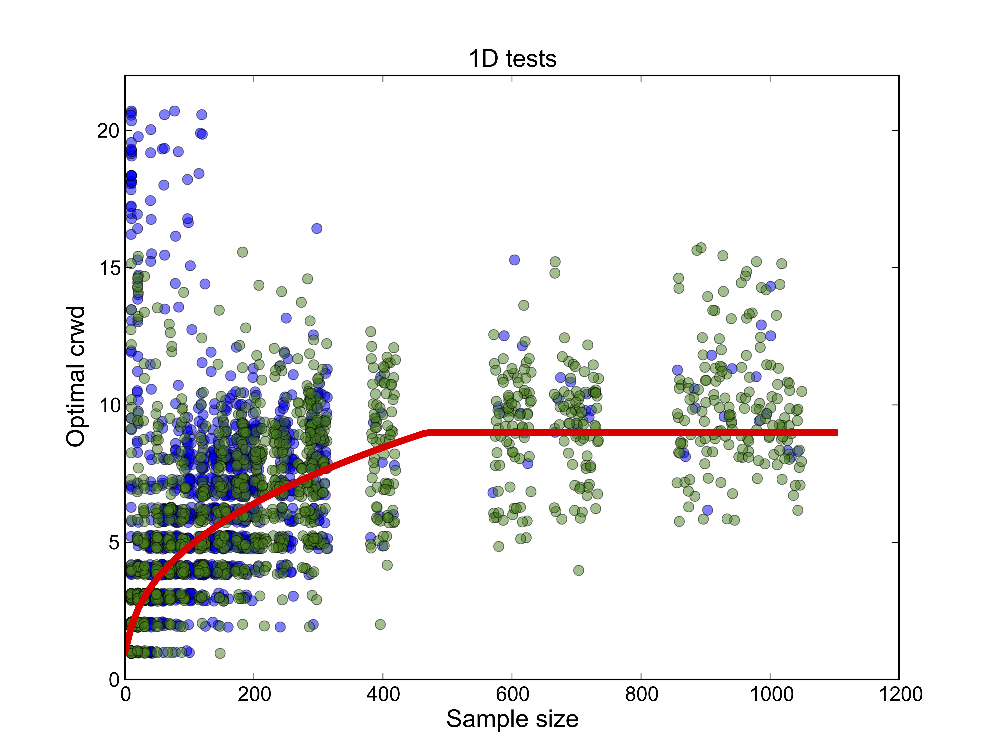
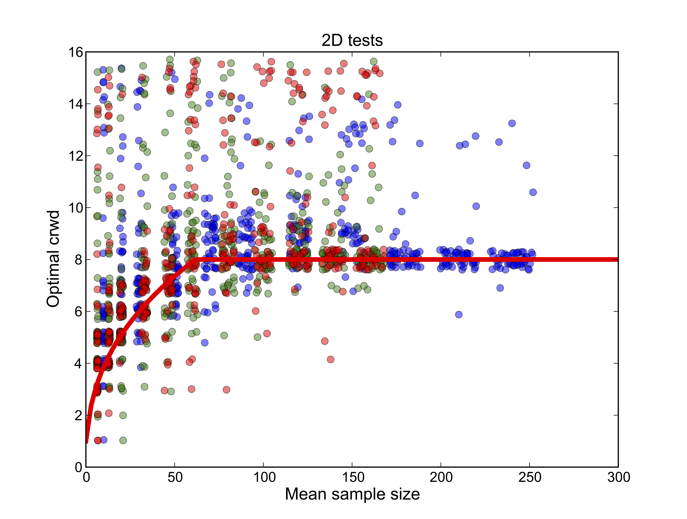
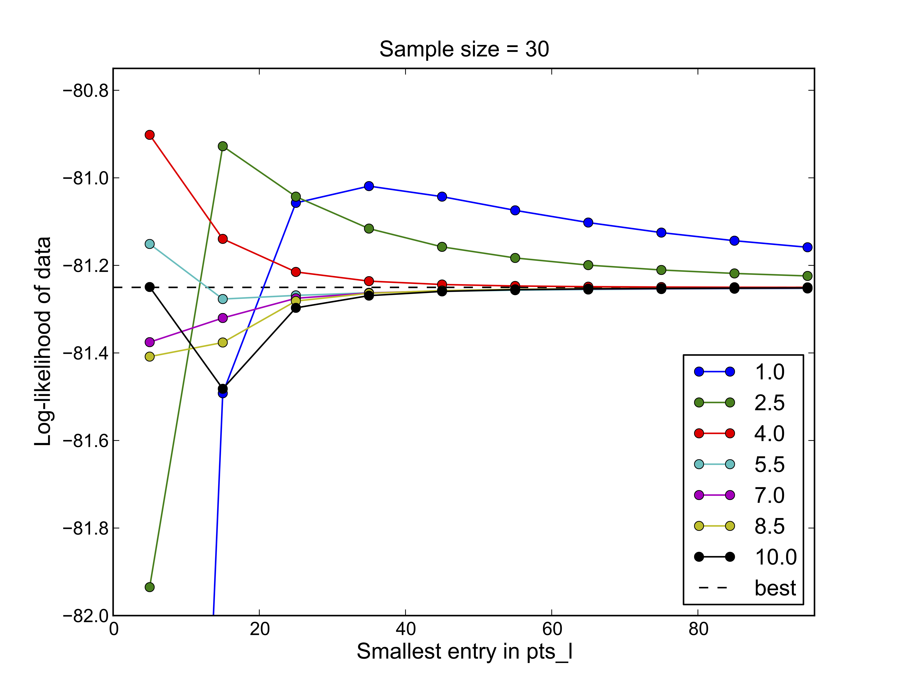

# Simulation and fitting

### Grid sizes and extrapolation

To simulate the frequency spectrum, dadi solves a partial differential equation, approximating the solution using a grid of points in population frequency space (the `phi` array). Importantly, a signle evaluation of the frequency spectrum with a fixed grid size is apt to be inaccurate, because computational limits mean the grid must be relatively coarse. To overcome this, dadi solves the problem at a series (typically 3) of grid sizes and extrapolates to an infinitely fine grid. To transform the demographic model function you have created (call it `my_demo_func`) into a function that does this extrapolation. wrap it using a call to `Numerics.make_extrap_func`, e.g.:

	my_extrap_func = Numerics.make_extrap_func(my_demo_func)

Having done this, the final argument to `my_extrap_func` is now a *sequence* of grid sizes, which will be used for extrapolation. In our experience, good results are obtained by setting the smallest grid size slightly larger than the largest population sample size. For example, if you have sample sizes of 16, 24, and 12 samples in the three populations you're working with, a good choice of grid sizes is probably `pts_l = [40, 50, 60]`. This can be altered depending on your usage. For example, if you are fitting a complex slow model, it may speed up the analysis considerably to first run an optimization at small grid sizes (even less than the maximum number of samples). This should get your parameter values approximately correct. They can be refined by running another optimization with a finer grid.

A simulated frequency spectrum is thus obtained by calling

	model = my_extrap_func(params, ns, pts_l)

Here `ns` is the sequenc of sample sizes for the populations in the model, `params` is the model parameters, and `pts_l` is the grid sizes.

#### Grid choice

As of version 1.5.0, the default grid in dadi has points exponentially clustered toward \\(x = 0\\) and \\(x = 1\\). This grid was suggested by Simon Gravel. The parameter `crwd` controls how closely grid points crowd the endpoints of the interval.

We have performed some empirical investigations of the best value for `crwd`, although these results cannot be considered definitive. We ran simulations for a variety of models and parameter values for a variety of sample sizes. Denoting the largest sample size as `n`, we asked which value of `crwd` yielded the most accurate FS with `pts_l = [n, n+10, n+20]`. Results are shown in above. It is evident that the best value for `crwd` is lower for smaller sample sizes. The red lines are empirical functions which approximate the optimum. These are implemented in `Numerics.estimate_best_exp_grid_crwd`. The lower figure demonstrates that the optimum value of `crwd` doesn't depend strongly on the number of grid points used for integration. Unless you need absolute top performance, the default value of `crwd = 8` will probably be sufficient.

### Likelihoods

dadi offers two complimentary ways of calculating the likelihood of the data FS given a model FS. The first is the Poisson approach, and the second is the multinomial approach.

In the Poisson approach, the likelihood is the product of Poisson likelihoods for each entry in the data FS, given an expected value from the model FS. This approach is relevant if \\(\theta_0\\) is an explicit parameter in your demographic function. Then the likelihood `ll` is 

	ll = dadi.Inference.ll(model, data)

In the multinomial approach, before calculating the likelihood, dadi will calculate the optimal \\(\theta_0\\) for comparing model and data. (It turns out that this is just \\(\theta_0 = \sum\text{data}/\sum\text{model}\\).) Because \\(\theta_0\\) is so trivial to estimate given the other parameters in the model, it is most efficient for it *not* to be an explicit parameter in the demographic function. Then the likelihood `ll` is

	ll = dadi.Inference.ll_multinomial(model, data)

The optimal \\(\theta_0\\) can be requested via

	theta0 = dadi.Inference.optimal_sfs_scaling(model, data)

### Fitting

To find the maximum-likelihood model parameters for a given data set, dadi employs non-linear optimization. Several optimization methods are provided, as detailed in the Which optimizer should I use section.

#### Parameter bounds

In their exploration, the optimization methods typically try a wide range of parameter values. For the methods that work in terms of log parameters, that range can be very wide indeed. As a consequence, the algorithms may sometimes try parameter values that are very far outside the feasible range and that cause *very* slow evaluation of the model FS. Thus, it is important to place upper and lower bounds on the values they may try. For divergence times and migration rates, large values cause slow evaluation, so it is okay to put the lower bound to 0 as long as the upper bound is kept reasonable. In our analyses, we often set the upper bound on times to be 10 and the upper bound on migration rates to be 20. For population sizes, very small sizes lead to very fast drift and consequently slow solution of the model equations; thus a non-zero lower bound is important, with the upper bound less so. In our analyses, we often set the lower bound on population sizes to be 10-2 or 10-3 (i.e. `1e-2` or `1e-3`).

If your fits often push the bounds of your parameter space (i.e., results are often at the bounds of one or more parameters), this indicates a problem. It may be that your bounds are too conservative, so try widening them. It may also be that your model is misspecified or that there are unaccounted biases in your data.

### Fixing parameters

It is often useful to optimize only a subset of model parameters. A common example is doing likelihood-ratio tests on nested models. The optional argument `fixed_params` to the optimization methods facilitates this. As an example, if `fixed_params = [None, 1.0, None, 2.0]`, the first and third model parameters will be optimized, with the second and fourth parameters fixed to 1 and 2 respectively. Note that when using this option, a full length initial parameter set `p0` should be passed in.

### Which optimizer should I use?

dadi provides a multitude of optimization algorithms, each of which perform best in particular circumstances.

The two most general purpose routines are the BFGS methods implemented in `dadi.Inference.optimize` and `dadi.Inference.optimize_log`. These perform a local search from a specified set of parameter, using an algorithm which attempts to estimate the curvature of the likelihood surface. However, these methods may have convergence problems if the maximum-likelihod parameters are at one or more of the parameter bounds.

dadi also implements two L-BFGS-B methods, `dadi.Inference.optimize_lbfgsb` and `dadi.Inference.optimize_log_lbgfsb`. These implement a variant of the BFGS method that deals much more effectively with bounded parameter spaces. If your optimizations are often hitting the parameter bounds, try using these methods. Note that it is probably best to start with the vanilla BFGS methods, because the L-BFGS-B methods will always try parameter values at the bounds during the search. This can dramatically slow model fitting.

We also provide a simplex (a.k.a. amoeba) method in terms of log parameters, implemented in `dadi.Inference.optimize_log_fmin`. This method does not use derivative information, so it may be more robust than the BFGS-based methods, but it is much slower.

Finally, there is a simple grid search, implemented in `daid.Inference.optimize_grid`.

Both BFGS and simplex are local search algorithms; thus they are efficient, but not guaranteed to find the global optimum. Thus, it is important to run several optimizations for each data set, starting from different initial parameters. If all goes well, multiple such runs will converge to the same set of parameters and likelihood, and this likelihood will be the highest found. This is strong evidence that you have indeed found the global optimum. To facilitate this, dadi provides a method `dadi.Misc.perturb_params` that randomly perturbs the parameters passed in to generate a new initial point for the optimization. 
